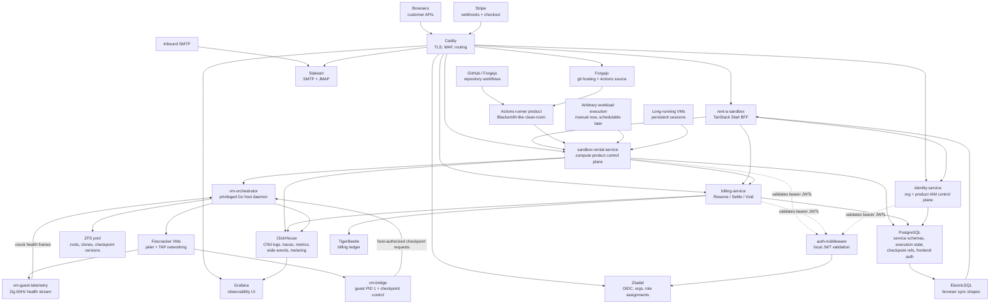

# Service Architecture

`sandbox-rental-service` is the product control plane for three related compute
products: a Blacksmith-like clean-room Actions runner, arbitrary workload
execution, and long-running VMs. These products must reuse the same runtime
substrate rather than developing separate runners: `vm-orchestrator` manages the
privileged host operations, `vm-bridge` exposes a narrow guest control surface,
`vm-guest-telemetry` streams health data, Firecracker provides the isolation
boundary, and ZFS zvols/checkpoints provide fast restore and persistent
filesystem semantics.

`sandbox-rental-service` owns customer semantics: organization policy, workflow
planning, execution records, checkpoint refs, billing windows, logs, public DTOs,
and the future scheduling model. `vm-orchestrator` owns privileged VM lifecycle
and ZFS operations. Guest checkpoint requests are untrusted input; the guest may
name only service-authorized checkpoint refs, and it must never provide org IDs,
ZFS paths, dataset names, or checkpoint version paths.

The next architecture gaps are customer secret management and block-layer
composition. Secret handling needs a first-class product service rather than
ad hoc execution env vars. zvol restore/composition belongs behind the
`sandbox-rental-service` checkpoint policy model and the `vm-orchestrator`
privileged restore API, not in customer-visible ZFS paths.

## Wire Contracts

See [wire-contracts.md](../../src/apiwire/docs/wire-contracts.md). `src/apiwire` owns shared Huma DTOs, decimal 64-bit JSON/OpenAPI types, and cross-service field language. Service domain packages can keep native Go types, but Huma boundary structs use `apiwire` DTOs when a frontend, generated client, or another service consumes the shape.

## Identity And IAM

See [identity-and-iam.md](../../src/platform/docs/identity-and-iam.md). Zitadel owns identity and role assignments, Forge Metal owns product policy documents and organization management UX, and each Go service owns the operation catalog it enforces.

## Secrets Plane

See [secrets-plane-openbao.md](../../src/platform/docs/secrets-plane-openbao.md). `secrets-service` is the customer-facing control plane for org/repo/environment secrets and variables, with OpenBao as the preferred backend implementation.

## Deploy Trace Correlation

Ansible deploys emit OTLP traces (`ServiceName='ansible'`) to `default.otel_traces`
through `deploy_traces.py`, while `deploy_events.py` writes one rollup row to
`forge_metal.deploy_events`. Both are keyed by the same deterministic identity:

- `deploy_run_key = YYYY-MM-DD.<counter>@<controller-host>`
- `deploy_id = UUIDv5("forge-metal:" + deploy_run_key)`
- `trace_id = hex(deploy_id)`

`fm_uri` carries this identity into service HTTP probes via `traceparent`,
`baggage`, and `X-Forge-Metal-*` headers. Go services attach those headers as
span attributes (`forge_metal.deploy_id`, `forge_metal.task_instance_id`,
`forge_metal.probe_id`, etc.), so a single ClickHouse query over `TraceId` can
show both deploy tasks and downstream service spans for proof-level debugging.
