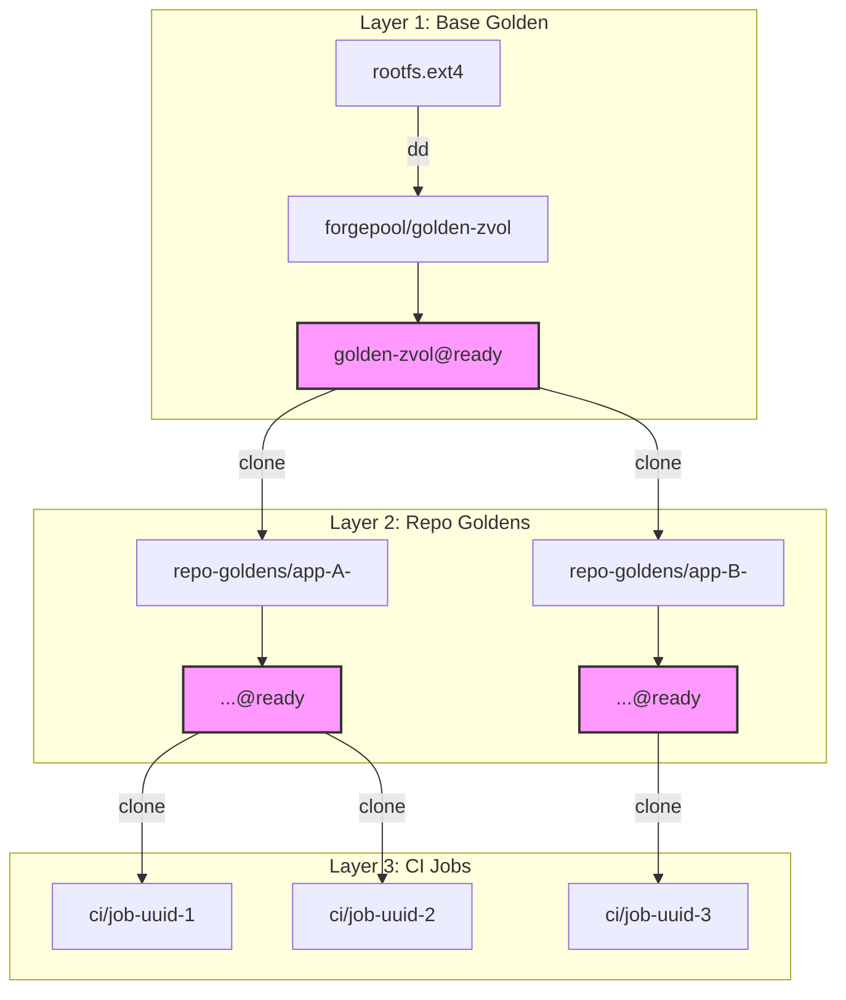
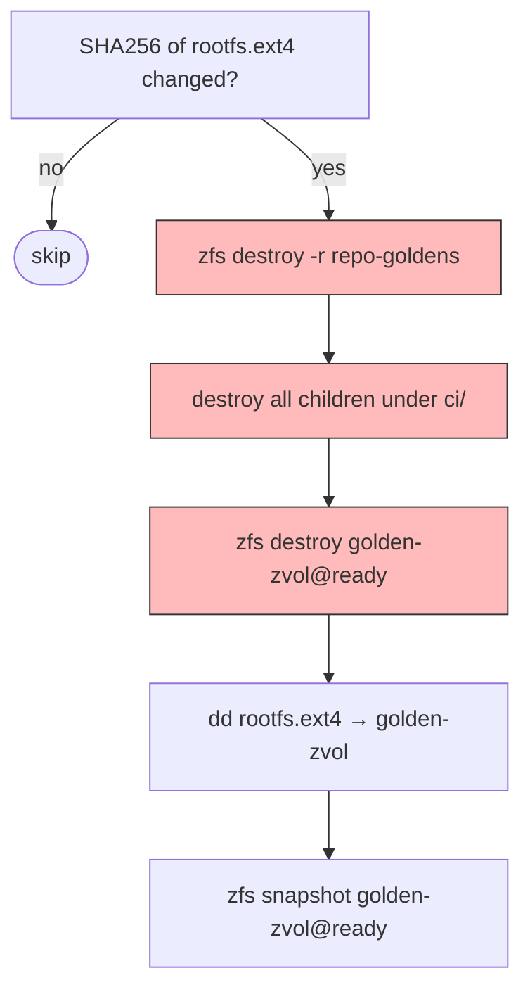

# ZFS Golden Image Lifecycle

Three-tier zvol clone hierarchy. Each CI job's rootfs traces back to one base image through two clone levels.



| Layer | Contains | Created by |
|-------|----------|------------|
| **Base golden** | Alpine + Node + git + PID 1 | Ansible `firecracker` role |
| **Repo golden** | Base + repo checkout + warmed `node_modules` | `forge-metal ci warm` |
| **CI job clone** | Repo golden + PR branch delta | `forge-metal ci exec` |

## Snapshot dependency rule

**A snapshot cannot be destroyed while clones exist.** Tear down leaf-to-root.

Replacing the base golden requires destroying all repo goldens and CI jobs first. The Ansible role does this automatically when it detects the rootfs SHA256 changed.

## Refresh flow



Trigger: rootfs hash mismatch, missing zvol/snapshot, or `firecracker_refresh_base_golden: true`.

## Warm path (`ci warm`)

1. `zfs clone golden-zvol@ready` → new `repo-goldens/<key>-<unix-nano>`
2. Mount, `git clone` repo, detect toolchain, unmount
3. Boot Firecracker VM, run install/prepare
4. `fsck.ext4 -n`, snapshot as `@ready`
5. Record active dataset, destroy previous generation

New dataset per warm. Old one destroyed only after new one promotes. Always a valid golden.

## Exec path (`ci exec`)

1. `zfs clone repo-golden@ready` → `ci/<job-uuid>` (~1.7ms)
2. Mount, `git fetch` PR ref, check if lockfile changed, unmount
3. Boot VM. Skip `npm install` if lockfile unchanged (warm caches intact)
4. `zfs get written` for telemetry, then `zfs destroy`

## Dev hot-swap (`make smelter-dev`)

Clone base golden → mount → replace one binary → snapshot → boot VM → probe → destroy. ~10s loop, no rootfs rebuild.

## On disk

```
forgepool/
├── golden-zvol                         (4G zvol, volblocksize=16K, lz4)
│   └── @ready                          (origin for repo goldens)
├── repo-goldens/
│   ├── app-A-1743523200                (clone of golden-zvol@ready)
│   │   └── @ready                      (origin for CI jobs)
│   └── app-B-1743523201
│       └── @ready
└── ci/
    └── job-a1b2c3d4                    (clone of app-A@ready)
```

## Debugging

```bash
zfs list -r -t all forgepool              # full hierarchy
zfs get origin forgepool/repo-goldens/X   # what was this cloned from
zfs get -r clones forgepool/golden-zvol@ready  # who depends on this snapshot
zfs get written forgepool/ci/job-X        # COW bytes dirtied
zfs list -t snapshot -o name,clones forgepool/golden-zvol@ready  # safe to destroy?
```

## Guest perspective

Guest sees `/dev/vda` with ext4. No ZFS in guest. COW is transparent at block layer.
