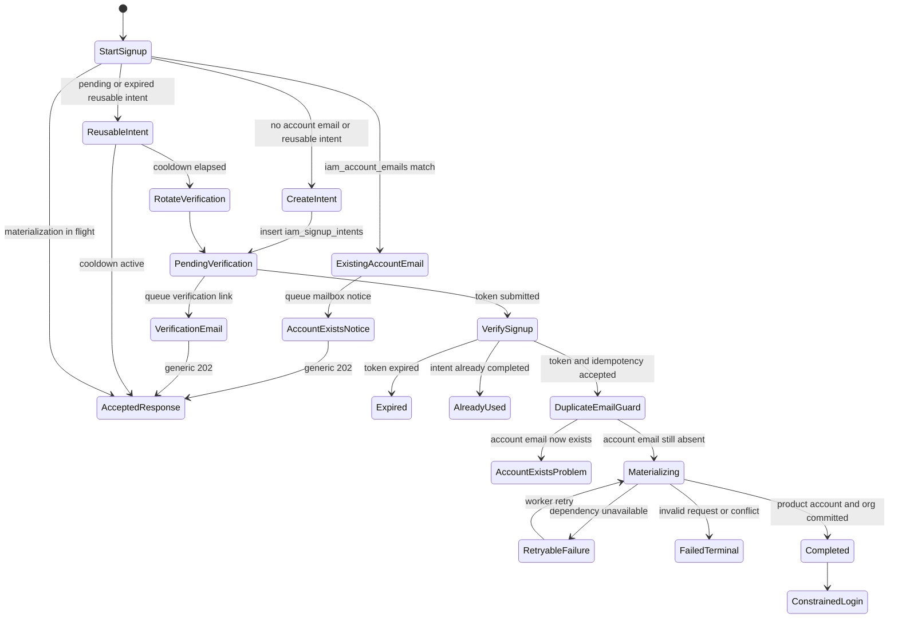
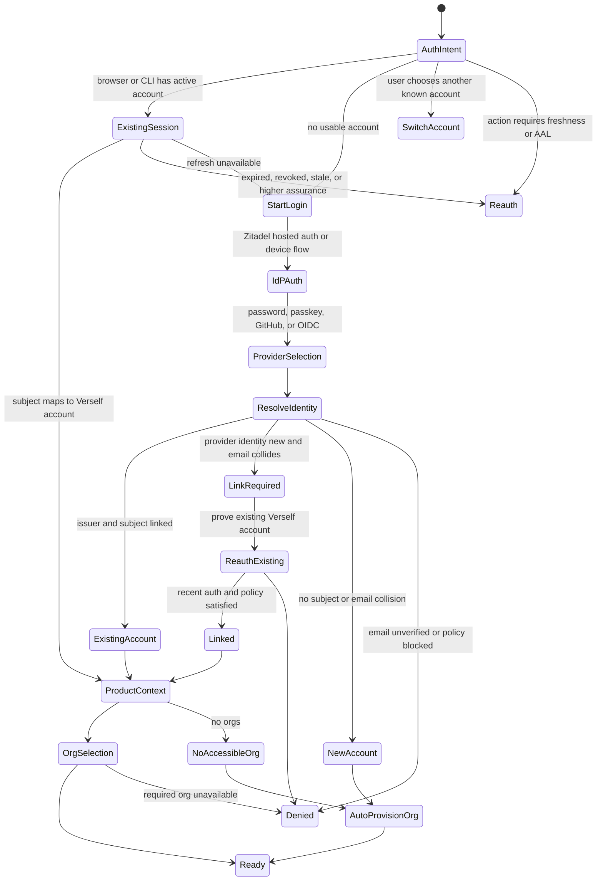
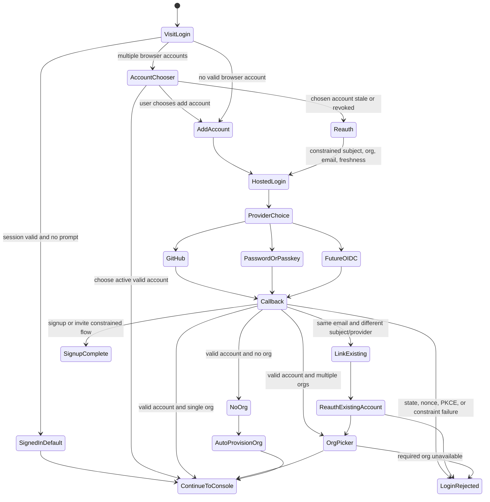
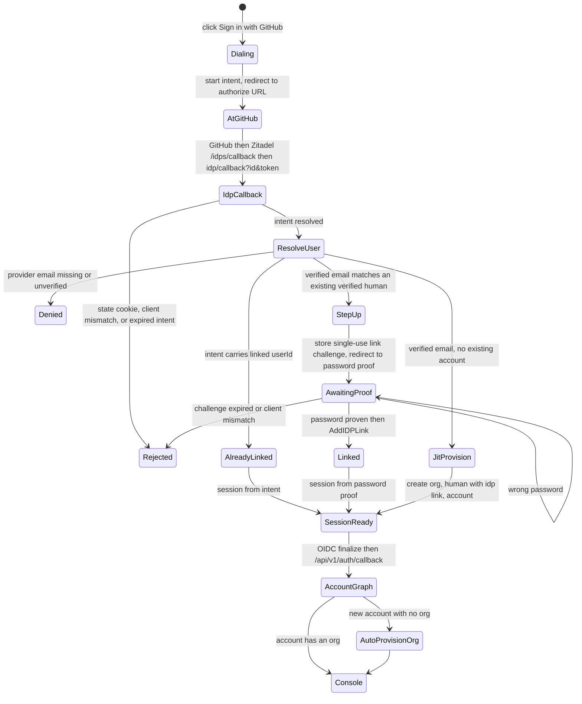

# IAM Service

`iam-service` is the product account and authorization control plane. Zitadel is
the OIDC provider and identity broker for human authentication, external IdPs,
GitHub, passkeys, MFA, password lifecycle, and authentication-layer account
linking. SPIRE remains the authority for repo-owned workload identity. SpiceDB is
the relationship authorization database. `iam-service` owns the relying-party
account graph, organization membership, device/session registry, product
authorization APIs, projection invalidation, audit, and reconciliation.

Product services remain enforcement points. They enforce by calling the
service-owned `iam-service` client over SPIFFE mTLS or by using a narrow
repo-owned IAM client package that itself calls that transport. Product services
do not receive SpiceDB credentials, construct raw SpiceDB tuples, choose SpiceDB
consistency modes directly, or infer product authorization from browser state.

## Authority Boundaries

| Concern | Authority |
| --- | --- |
| Human authentication, external IdP brokering, OIDC, MFA, passkeys, password lifecycle, auth-layer account linking | Zitadel |
| Product account graph, org membership projection, device/session registry, auth-context APIs | `iam-service` |
| Service-account credential authentication and directory profile source | Zitadel through `iam-service/internal/directory` |
| Repo-owned workload authentication | SPIRE |
| Product authorization graph | SpiceDB |
| Product authorization API, schema lifecycle, relationship writes, audit, revocation epochs | `iam-service` |
| Product resource state | Owning service PostgreSQL database |
| Authorization evidence, audits, and operator inspection | ClickHouse plus `governance-service` |
| Public TLS and routing | HAProxy plus prod Cloudflare/TLS control-plane certificate projection |

SpiceDB is private substrate. It has no public origin, no browser-facing route,
and no direct product-service credential distribution. HAProxy is involved only
if a future multi-node deployment needs an internal TCP/L4 gRPC frontend for
several SpiceDB processes.

## Core Invariants

- Raw SpiceDB imports are confined to `iam-service/internal/spicedb`.
- Product services use typed authorization operations, not arbitrary
  object-type, relation, permission, or subject strings.
- Human users, service accounts, and workloads are distinct SpiceDB subject
  types. API keys, private keys, and client secrets authenticate a service
  account; they are not authorization subjects.
- Public IAM policy APIs follow Google Cloud IAM semantics:
  `getIamPolicy`, `setIamPolicy`, and `testIamPermissions`.
- Public HTTP routes are Smithy-modeled concrete resource routes. SDKs expose
  URN resource-name helpers over those routes.
- Policy replacement requires optimistic concurrency through `etag` after
  bootstrap/default creation.
- Authorization checks return typed decision evidence, not bare booleans.
- Every security-sensitive check carries an explicit freshness policy.
- Product mutations that require authorization accept typed decision evidence.
- Relationship writes are idempotent by default and carry transaction metadata.
- Public mutations require an idempotency key. Internal mutations require a
  command request ID or idempotency key in the Smithy-modeled internal contract.
- List APIs use `page_size`, `page_token`, `next_page_token`, `filter`, and
  `order_by` rather than offset pagination.
- A resource is not exposed to read paths until its authorization parent edges
  have been acknowledged by SpiceDB and represented by a ZedToken.
- List endpoints declare their authorization strategy before implementation:
  coarse gate, `LookupResources`, `CheckBulkPermissions`, or bounded
  materialized projection.
- Electric shape issuance is mediated by bounded capabilities with fixed
  route, columns, predicate template, freshness, expiry, and revocation epoch
  state.
- SpiceDB Watch, IAM outbox rows, and ClickHouse evidence are part of the
  correctness model.
- OAuth refresh tokens, device-code login, and PKCE remain Zitadel/OIDC
  concerns. `iam-service` validates access tokens and manages product
  authorization state; it does not become an OAuth authorization server.
- OIDC issuer and subject identify an authenticated human subject. Email address
  matches are collision signals and account-linking inputs. Account merges
  require explicit linking.
- Linking a new provider identity to an existing Verself account requires recent
  proof of the existing account and policy checks for the target connection.
- Browser, CLI, and SDK channels initiate authentication and select account/org
  context. Product services enforce authorization at service and data boundaries.
- Public signup creates a signup intent and sends a verification email only for
  new-account or reusable-intent flows. Existing account emails receive an
  account-exists notice without creating intent state. Signup does not create a
  Zitadel user, Zitadel organization, IAM organization row, SpiceDB
  relationship, product account, service account, or billing customer until
  verification succeeds.
- Invite acceptance activates an invited directory user through the public IAM
  acceptance API. Member invitation remains an authenticated org-scoped
  mutation.

## Signup and Invite Activation

Signup is modeled as an installation-scoped public flow:

```text
POST /api/v1/signup-intents
GET /api/v1/organization-slugs/{slug}/availability
POST /api/v1/signup-intents/{signupIntentId}/verification
```

`StartSignup` records a pending signup intent with a delivery email, canonical
email identity fingerprint, draft organization display name, optional org slug,
verification expiry, idempotency metadata, request attribution, and delivery
state. Signup accepts a single mailbox address. Domains are canonicalized with
IDNA, Unicode local parts are normalized to NFC, and `+` subaddress detail is
preserved for delivery while excluded from the identity fingerprint.
The operation returns a generic accepted response. The response must not reveal
whether the email identity already belongs to a user or pending invite. When the
canonical email identity is already attached to an account, IAM does not create a
signup intent; it queues an account-exists notice to the mailbox and returns the
generic accepted response. Repeated starts for the same email identity reuse the
current reusable intent. After a short per-email cooldown, IAM rotates the
verification token and sends a fresh email for the same signup intent ID; within
the cooldown it returns the generic accepted response without another delivery.
In-flight materialization states return the same generic accepted response
without creating a second organization or sending an email.



`CheckOrganizationSlugAvailability` is a public read used by signup UI and
automation. It is a convenience check; `VerifySignup` repeats the slug
availability check before Zitadel side effects and the `iam_organizations`
insert remains the final authority under race.

`VerifySignup` consumes the verification token and final organization display
name and slug. Only this operation may create the Zitadel human, create the
Zitadel organization, verify the Zitadel email, insert `iam_organizations`, bind
the user as `roles/owner`, and emit governance API activity for the materialized
organization. Password setup, password change, passkey setup, social login, MFA,
and other authentication-method lifecycle work remain Zitadel-owned flows
outside onboarding finalization. Local password authentication is production
eligible only when the Zitadel-owned password path enforces NIST length,
throttling, no-routine-rotation, no-composition-rule, and breached-password
requirements. The HIBP Pwned Passwords range protocol integration under
`src/integrations/hibp` is the repo-owned breached-password checking primitive;
it sends only the SHA-1 prefix and compares suffixes locally.

Invites are split across authenticated and public operations:

```text
POST /api/v1/orgs/{orgId}/members:invite
POST /api/v1/auth/invites/accept
```

`InviteMember` is authenticated and authorized by `iam:member:invite` on the
target org. It creates a pending directory user, writes a hashed invite
acceptance token, reconciles role bindings, and sends the invite email.
`AcceptMemberInvite` is public, rate-limited as signup traffic, idempotent, and
consumes only the invite acceptance token.

Public signup and invite acceptance are installation-scoped for rate limiting,
audit, and bot-defense decisions. Org-scoped audit begins at verification or
invite acceptance, when the target org and actor are known. Unverified intents
and invalid token attempts still emit security telemetry with request
attribution, but they do not produce customer-visible IAM state.

Signup verification failures use RFC 9457 problem details with stable problem
codes. Invalid and expired verification links are client-correctable 400
responses. Reused links, concurrent materialization, signup state conflicts, and
unavailable organization slugs are 409 responses. A slug conflict before
provider side effects remains retryable with the same verification code until
expiry. Account-exists collisions return the generic accepted response on
`StartSignup` and are explained only by email to the mailbox owner. `VerifySignup`
re-checks the durable account email projection before provider side effects so a
race cannot create a duplicate Zitadel human or product account.

## Organization Seeding And Promotion

Organization seeding must go through service APIs rather than direct writes to
Zitadel, SpiceDB, IAM PostgreSQL, or billing PostgreSQL. The self-serve path is
`StartSignup` followed by `VerifySignup`; verification materializes the Zitadel
organization, Zitadel human, IAM organization row, SpiceDB owner policy, and
billing organization. Operator-created organizations with an existing actor use
the authenticated `CreateOrganization` path, which performs the same IAM,
SpiceDB, and billing provisioning steps.

Billing posture is adjusted through billing-service internal APIs after the IAM
organization exists:

```text
POST /internal/billing/v1/orgs
POST /internal/billing/v1/orgs/{org_id}/trust-tier
POST /internal/billing/v1/orgs/{org_id}/plan-promotions
POST /internal/billing/v1/orgs/{org_id}/plan-promotions:cancel
```

`EnsureBillingOrganization` is an idempotent create/provision operation. It may
refresh display metadata and current free-tier accounting, but it must not
overwrite an existing org's trust tier, overage policy, or overage consent.
Trust tier promotion and demotion use `SetOrganizationTrustTier` with values
such as `platform` or `new`. Billing promotion to a paid plan with a 100%
internal discount uses `ApplyBillingPlanPromotion`; demotion back to free-tier
behavior uses `CancelBillingPlanPromotion`, which schedules the internal
contract cancellation through the normal contract state machine.

## Substrate

The current deployment uses a Nomad-managed SpiceDB process backed by
PostgreSQL:

```text
src/infrastructure-components/spicedb/nomad.hcl
  gRPC API:       Nomad service spicedb-grpc, loopback dynamic port
  metrics/pprof:  Nomad service spicedb-metrics, loopback dynamic port
  HTTP gateway:   disabled
  datastore:      PostgreSQL database spicedb
  auth:           gRPC preshared key, private to spicedb and iam-service
```

PostgreSQL is the initial datastore because the platform is currently
single-region and single-node. PostgreSQL is also the substrate the platform
already operates, backs up, observes, and converges through owner-local
deployment metadata. PostgreSQL must run with `track_commit_timestamp=on` before
the SpiceDB Watch API is used.

CockroachDB is the later datastore when one of these becomes material:

- authorization throughput is bounded by PostgreSQL rather than schema shape or
  cache behavior;
- the 3-node topology needs datastore-level fault tolerance for authorization;
- multi-region authorization latency becomes a product constraint;
- CockroachDB-only SpiceDB features, especially Relationship Integrity, justify
  the additional distributed database.

The migration path between datastore types is SpiceDB-level export/import or
`zed backup`, not `pg_dump` and `pg_restore`. `iam-service` being the only
writer keeps that migration a substrate swap behind a stable product API.

## Zanzibar Model

SpiceDB implements a Zanzibar-style authorization graph. Relationships have
the shape:

```text
object_type:object_id#relation@subject_type:subject_id
object_type:object_id#relation@subject_object#subject_relation
```

Examples:

```text
org:acme#member@user:alice
role:deployers#member@user:alice
repository:repo_123#parent_org@org:acme
execution:exec_456#repository@repository:repo_123
attempt:att_789#execution@execution:exec_456
```

The schema defines object types, stored relations, and computed permissions:

```zed
use typechecking

definition user {}
definition service_account {}
definition workload {}

definition role {
  relation member: user | service_account
}

definition org {
  relation owner: user | service_account
  relation admin: user | service_account
  relation member: user | service_account
  relation execution_lister: user | service_account | role#member

  permission read = owner + admin + member
  permission manage_iam = owner + admin
  permission list_executions = owner + admin + execution_lister
}

definition repository {
  relation parent_org: org

  permission read = parent_org->read
  permission write = parent_org->manage_iam
}

definition execution {
  relation repository: repository

  permission read = repository->read
}

definition attempt {
  relation execution: execution

  permission read_logs = execution->read
}

definition operation_permission {
  relation grantee: user | service_account | workload

  permission use = grantee
}
```

This graph makes broad revocation cheap. If a role with 1,000 members loses
`list_executions` over an org with 1,000,000 executions, the authorization
mutation is one relationship or grant change plus active-stream invalidation.
The 1,000,000 execution rows are not rewritten, and no per-principal
execution projection is deleted.

## Resource Modeling

Model authorization-relevant resources and inheritance boundaries:

- `org`
- `role`
- `service_account`
- `api_credential`
- `operation_permission`
- `project`
- `environment`
- `repository`
- `execution`
- `attempt`
- `secret`
- `transit_key`
- `document`
- `email_identity`

Avoid relationships for high-volume append-only leaf data. Execution log chunks
inherit access from `attempt`; they do not receive one SpiceDB relationship per
chunk.

Customer-facing capability toggles and API-credential permission grants are
represented as durable authorization relationships. Direct operation grants use
`operation_permission:{permission}#grantee@service_account:{id}`. Role and
membership grants remain resource relationships such as
`org:{org_id}#member@service_account:{id}`. A toggle change increments a coarse
scope epoch and forces affected active streams to recheck.

## Go Service Shape

`iam-service` is a Go service using the same service contract as the rest of
the product surface: Smithy-modeled HTTP contracts, service-local typed
clients/adapters, SPIFFE mTLS for internal calls, sqlc for PostgreSQL, and OpenTelemetry
spans that land in ClickHouse. Public Huma routes are implemented by the
service and checked against the Smithy/OpenAPI contract boundary.

Repository layout:

```text
src/services/iam-service/
  cmd/
    iam-service/
    iam-openapi/
    iam-schema-gen/

  openapi/

  client/

  migrations/

  schema/
    verself.zed
    assertions.yaml
    expected-relations.yaml

  internal/model/
    generated object, relation, permission, caveat, and resource-ref types

  internal/bootstrap/
    runtime configuration, dependency wiring, worker startup

  internal/spicedb/
    only package allowed to import the AuthZed Go client

  internal/authz/
    typed Check, CheckBulk, Lookup, Write, Delete, and Watch APIs

  internal/decision/
    Decision, ZedToken, Freshness, Epoch, and capability types

  internal/orgs/
    organization profile, organization lookup, available-org listing

  internal/members/
    directory-backed member listing, invite, and removal commands

  internal/roles/
    customer-visible role catalog, policy binding validation, and permission
    metadata

  internal/policies/
    getIamPolicy, setIamPolicy, testIamPermissions, etag handling, and
    binding compilation

  internal/credentials/
    customer API credential metadata, grants, roll, revoke, claim resolution

  internal/browser/
    OIDC login, callback, session, selected org, logout, resource tokens

  internal/actions/
    Zitadel action verification and claim response construction

  internal/syncauth/
    Electric shape capability issuance, epoch validation, active stream index

  internal/resourceedges/
    product service resource-parent relationship commands

  internal/commands/
    shared command envelope, idempotency, operation metadata, and outbox helpers

  internal/watch/
    SpiceDB Watch consumer, epoch invalidation, reconciliation checkpoints

  internal/reconcile/
    expected relationship scanners and repair plans

  internal/audit/
    governance audit writer and ClickHouse evidence helpers

  internal/problems/
    stable problem responses and tagged domain error mapping

  internal/directory/
    Zitadel adapter behind product-shaped interfaces

  internal/store/
    sqlc queries for IAM metadata, outbox, epochs, capability leases, and
    reconciliation state

  internal/api/
    route registration and boundary DTO conversion only
```

## Contract Shape

The public IAM API copies Google Cloud IAM semantics:

- `getIamPolicy`: read the policy attached to a resource.
- `setIamPolicy`: replace the policy attached to a resource using `etag`
  concurrency.
- `testIamPermissions`: return the subset of requested permissions the caller
  currently has on a resource.

Google's REST docs often use gRPC-transcoding paths such as
`/{resource=projects/*}:setIamPolicy`. The public IAM contract uses ordinary
HTTP resource routes because slash-containing resource names are poor path
labels for broad HTTP tooling. `iam-service` therefore registers concrete
routes for each policy-bearing resource type and lets SDK helpers translate
resource names to those routes.

Initial public policy routes:

```text
GET  /api/v1/organizations/{org_id}/iamPolicy
PUT  /api/v1/organizations/{org_id}/iamPolicy
POST /api/v1/organizations/{org_id}/iamPolicy:testPermissions

GET  /api/v1/projects/{project_id}/iamPolicy
PUT  /api/v1/projects/{project_id}/iamPolicy
POST /api/v1/projects/{project_id}/iamPolicy:testPermissions

GET  /api/v1/repositories/{repository_id}/iamPolicy
PUT  /api/v1/repositories/{repository_id}/iamPolicy
POST /api/v1/repositories/{repository_id}/iamPolicy:testPermissions

GET  /api/v1/secrets/{secret_id}/iamPolicy
PUT  /api/v1/secrets/{secret_id}/iamPolicy
POST /api/v1/secrets/{secret_id}/iamPolicy:testPermissions
```

Only resource types that support directly attached policy receive these routes.
Inherited leaf resources such as execution attempts may support
`testIamPermissions` without supporting `setIamPolicy`.

During cutover, Huma operation declarations should stay next to shared
`service-runtime/iam` policy metadata that mirrors the Smithy operation traits:

```go
registerIAMRoute(api, huma.Operation{
    OperationID:   "set-organization-iam-policy",
    Method:        http.MethodPut,
    Path:          "/api/v1/organizations/{org_id}/iamPolicy",
    Summary:       "Set organization IAM policy",
    DefaultStatus: http.StatusOK,
}, runtimeiam.OperationPolicy{
    Permission:     permissionIAMPolicySet,
    Resource:       resourceOrganizationIAMPolicy,
    Action:         runtimeiam.ActionWrite,
    OrgScope:       runtimeiam.OrgScopePathOrgID,
    RateLimitClass: rateLimitIAMPolicyMutation,
    Idempotency:    runtimeiam.IdempotencyHeaderKey,
    AuditEvent:     auditOrganizationPolicyWrite,
    BodyLimitBytes: bodyLimitSmallJSON,
}, setOrganizationIAMPolicy(svc))
```

`OperationPolicy` deliberately has one stable service-owned `AuditEvent` source
value. Governance/OCSF/SIEM category mappings belong in the audit pipeline so
product services do not invent local taxonomy strings.

Core wire DTOs:

```go
type Policy struct {
    Version  int32     `json:"version"`
    ETag     string    `json:"etag"`
    Bindings []Binding `json:"bindings"`
}

type Binding struct {
    Role    string   `json:"role"`
    Members []string `json:"members"`
}

type SetIAMPolicyRequest struct {
    Policy     Policy `json:"policy"`
    UpdateMask string `json:"update_mask,omitempty"`
}

type TestIAMPermissionsRequest struct {
    Permissions []string `json:"permissions" minItems:"1" maxItems:"100"`
}

type TestIAMPermissionsResponse struct {
    Permissions []string `json:"permissions"`
}
```

Policy member strings use a small fixed vocabulary:

```text
user:{zitadel_subject}
serviceAccount:{service_account_id}
workload:{workload_id}
```

Role names use resource-name-like strings:

```text
roles/owner
roles/admin
roles/member
roles/execution.viewer
organizations/{org_id}/roles/{role_id}
```

`setIamPolicy` compiles policy bindings into typed SpiceDB relationship writes.
It does not store or evaluate a customer-editable policy language in the first
cut. Conditions and caveats can be added later as a deliberate schema/API
extension.

Standard list APIs use the Google AIP pagination vocabulary:

```go
type ListRolesInput struct {
    Parent    string `query:"parent,omitempty" maxLength:"256"`
    PageSize  int    `query:"page_size,omitempty" minimum:"1" maximum:"100"`
    PageToken string `query:"page_token,omitempty" maxLength:"1024"`
    Filter    string `query:"filter,omitempty" maxLength:"2048"`
    OrderBy   string `query:"order_by,omitempty" maxLength:"256"`
}

type ListRolesResponse struct {
    Roles         []Role `json:"roles"`
    NextPageToken string `json:"next_page_token,omitempty"`
}
```

Page tokens are opaque, URL-safe, and authorization-neutral. The service
reauthorizes every request that includes a page token.

All public operations accept `X-Request-ID` for trace correlation. Mutating
operations declare `Idempotency-Key` in the Smithy contract and generated
projections, and reject requests that omit it.

HTTP error responses use RFC 9457 Problem Details with stable Verself problem
types and trace-backed `instance` values. The SDK maps those problem documents
to language-native typed errors.

## Authentication, Account Graph, and Sessions

Authentication flows use standard OIDC/OAuth channel profiles:

- console: authorization code with PKCE and server-side browser session state;
- interactive CLI: OAuth device authorization grant against the hosted issuer;
- optional native-app CLI profile: authorization code with PKCE through the
  system browser;
- SDK workloads and CLI automation: workload identity or customer API
  credential;
- repo-owned service calls: SPIFFE mTLS on internal clients.

Refresh tokens are issued and refreshed by Zitadel's token endpoint. Product
resource APIs receive access tokens or resource tokens and validate them against
the product account graph, org context, session state, and IAM policy.

Target account state is split by responsibility:

| State | Owner | Purpose |
| --- | --- | --- |
| `iam_accounts` | `iam-service` | Stable Verself human account, risk state, lifecycle state, created/disabled timestamps. |
| `iam_account_subjects` | `iam-service` | Issuer-scoped OIDC subjects linked to a Verself account. Unique on `(issuer, subject)`. |
| `iam_account_connections` | `iam-service` | External provider identities observed through Zitadel, keyed by provider and external subject. Email claims are metadata. |
| `iam_account_emails` | `iam-service` | Verified mailbox identities, delivery address, canonical identity hash, login/recovery flags. |
| `iam_device_sessions` | `iam-service` | Browser, CLI, and SDK session/device registry, revocation state, last-seen evidence, auth freshness. |
| `iam_signup_intents` | `iam-service` | Installation-scoped signup state machine before product account materialization. |

Email identity deduplication protects signup and linking workflows from duplicate
materialization. Account merges require explicit linking. A provider login with
a new issuer/subject and an email already attached to a Verself account enters a
link-required state. Linking requires recent proof of the existing account and a
policy decision; the new provider subject is denied if it is already linked to a
different account.



Browser auth is a projection of that account state:

- browser client: the HTTP-only `verself_client` cookie and server row that
  identify one browser install;
- browser account: one issuer/subject under that browser client, encrypted token
  bundle, linked Verself account metadata, and available organizations;
- selected organization: the product org context for the active browser account.

Every browser product request resolves through browser client, active browser
account, selected organization, account session state, and authorization policy.
Browser JavaScript receives handles, user/org metadata, and a cache partition.
Zitadel refresh tokens and persisted product bearer tokens remain server-side.
Signup and invite completion return constrained login URLs with required subject,
email, and org metadata; the callback enforces those constraints server-side
because `prompt=select_account` and `login_hint` are OIDC hints.



### Sign in with GitHub (headless external IdP)

Zitadel's hosted Login V2 is disabled; iam-service is the OIDC relying party and
owns the login surface. "Sign in with GitHub" is brokered through Zitadel's
external-IdP intent over the Session API rather than the hosted login. The Verself
Runner GitHub App backs both this login (its user-to-server OAuth, registered in
Zitadel as a GitHub IdP) and CI installation.

| Step | Surface | Endpoint |
| --- | --- | --- |
| Start intent | iam-service | `POST /api/v1/auth/idp/github/start` → Zitadel `POST /v2/idp_intents` |
| Provider authorization | GitHub → Zitadel | GitHub authorize → `https://verself.sh/idps/callback` |
| Resume | iam-service | `GET /api/v1/auth/idp/callback?id&token` |
| Resolve external identity | Zitadel | `POST /v2/idp_intents/{id}` |
| Link existing human | Zitadel | `POST /v2/users/{id}/links` |
| Mint session | Zitadel | `POST /v2/sessions` with `checks.idpIntent` |
| Account graph + org | iam-service | OIDC RP callback `GET /api/v1/auth/callback` |

The Session API authenticates only an external identity that is already linked to
a Zitadel user. The IdP-level `autoLinking` and `isAutoCreation` options apply to
the hosted login flow and are inert here, so iam-service resolves the Zitadel user
before minting the session. The intent's `userId` is populated only when the
GitHub identity is already linked; otherwise the callback resolves the user by
verified email and links explicitly, or provisions a new identity.

Linking a GitHub identity to an existing account is gated on proof of control of
that account, not on the email match alone. The verified-email match selects the
candidate account; a password (or recovery) authentication against that account is
the linking authority. This holds the link decision to the same assurance as a
direct password login and removes any dependence on the provider's email
verification semantics. The proof reuses the password-login path: a successful
password authentication carrying the pending link challenge performs the
`AddIDPLink` as part of completing the session. New identities with no matching
account are provisioned just-in-time and never enter the link path.

Every account holds at least one organization. A just-in-time account with no
organization receives an auto-provisioned starter org during the callback, keyed
off the GitHub login, and lands directly in the console; organization name, slug,
and icon are customized later from settings.



A linked GitHub identity makes every subsequent sign-in a single redirect: the
intent carries the linked `userId`, the callback takes the `AlreadyLinked` branch,
and no proof or provisioning runs.

The console surface implied by the state machine includes login/account chooser,
provider choice, device/session-aware reauth, provider collision/link account,
org picker, signup/invite completion, rejected-login problem display, and a
security page for linked providers, emails, passkeys, MFA, and sessions.

Required implementation cases:

- no prior account;
- one valid prior account;
- multiple prior accounts on the same device;
- active account expired but refreshable;
- active account revoked remotely;
- switching to a stale account requires reauth;
- signup completion requires the exact created subject;
- invite acceptance requires the exact invited subject;
- GitHub login returns an already linked subject;
- GitHub login returns a new subject with an existing email and requires linking;
- provider email is missing or unverified;
- same provider subject is linked to another account;
- same email appears on multiple accounts and requires an explicit selector plus
  recent auth;
- user has no accessible org;
- user has multiple orgs;
- high-risk action requires fresh auth, passkey, or higher AAL;
- session is revoked from another device;
- back-channel logout invalidates browser/CLI session evidence;
- non-interactive CLI has no workload credential and receives a typed auth error.

Current-device revocation is presented as logout in the console. Revoking the
current browser client invalidates the same cookie that authorizes live auth
sync, so the UI must navigate through the normal TanStack logout route instead
of waiting for Electric to observe its own authorization loss. Electric remains
the convergence path for other-device revocation and remote invalidation.

## Feature Parity Surface

The target product IAM and auth-context surface is:

| Surface | Owning package | Notes |
| --- | --- | --- |
| Browser login, callback, logout, account read/switch/remove, selected org update | `internal/browser` | Owns browser-client and browser-account state plus OIDC token exchange. Does not perform product authorization decisions directly. |
| Browser resource tokens | `internal/browser` plus `internal/authz` | Resource token issuance is scoped to active account and selected org, and records token audience, org, scope, and freshness. |
| Product account graph | `internal/accounts` plus `internal/directory` | Maps issuer subjects, external provider connections, verified email identities, and Verself account lifecycle. |
| Device/session registry | `internal/sessions` | Records browser and CLI sessions, auth freshness, revocation state, back-channel logout evidence, and last-seen telemetry. |
| Account connections | `internal/accounts` plus `internal/directory` | Links and removes GitHub/OIDC/provider connections after recent proof of the existing account. |
| Reauth/login intents | `internal/browser` plus `internal/accounts` | Enforces required subject, email, org, freshness, and assurance constraints server-side. |
| Available organizations for the caller | `internal/orgs` | Uses token role assignments and directory-backed org metadata; returns only orgs the token proves. |
| Organization profile read/update/resolve | `internal/orgs` | Profile state lives in IAM PostgreSQL; authorization is checked through typed decisions. |
| Organization members | `internal/members` | Directory-backed read model for humans. Service accounts are listed and governed through their own resource surface. |
| Member invite and removal | `internal/members` | Mutations write directory state and SpiceDB relationships through command envelopes. |
| Signup intent and invite acceptance | `internal/signup` | Public installation-scoped commands own pending signup state, hashed verification tokens, account activation, and post-verification org materialization. |
| IAM policy binding update | `internal/policies` plus `internal/roles` | `setIamPolicy` validates role bindings and writes SpiceDB relationships as the customer-editable policy surface. |
| IAM policy get/set/test | `internal/policies` plus `internal/authz` | Google-IAM-style resource policy operations over Smithy-modeled HTTP APIs. `setIamPolicy` requires `etag` and idempotency after bootstrap. |
| Permission and role catalog | `internal/roles` plus `internal/policies` | Exposes predefined roles, org-scoped roles, and permission metadata for SDKs, CLI, and console affordances. |
| Service account list/read/disable | `internal/identity` plus `internal/authz` | Service accounts are non-human authorization subjects inside an organization. Direct permission grants are reconciled into SpiceDB. |
| API credential list/read/create/roll/revoke | `internal/identity` | Secret material is returned only at create or roll. Credentials authenticate service accounts and keep credential metadata in PostgreSQL. |
| API credential claim resolution | `internal/actions` plus `internal/identity` | Zitadel action calls resolve non-secret credential metadata, service-account identity, and exact allowed permissions from the authorization graph. |
| Human profile sync | `internal/orgs` or `internal/members` | Narrow internal operation for directory/profile propagation. |
| Resolve organization by ID or slug | `internal/orgs` | Narrow internal operation for other services and frontend server functions. |
| Authorization checks and list helpers | `internal/authz` | Typed `Check`, `CheckBulk`, `LookupResources`, and `LookupSubjects`. |
| Product resource edge writes | `internal/resourceedges` | SPIFFE-only internal API used by resource-owning services after product state writes. |
| Electric shape capability issuance | `internal/syncauth` | SPIFFE-only internal API used by the sync gateway. |

Feature parity does not mean preserving old route names, database tables,
package names, or implementation structure. The public and internal API shapes
should be cut over cleanly through updated clients and frontend server
functions.

## Package Boundaries

The service is organized by stable product responsibility. Shared packages
provide vocabulary and infrastructure; vertical packages own use cases.

```text
cmd/iam-service
  -> internal/bootstrap
  -> internal/api

internal/api
  -> internal/{orgs,members,roles,policies,credentials,browser,actions,syncauth,resourceedges}
  -> internal/problems

internal/{orgs,members,roles,policies,credentials,browser,actions,syncauth,resourceedges}
  -> internal/authz
  -> internal/commands
  -> internal/store
  -> internal/directory
  -> internal/audit

internal/authz
  -> internal/model
  -> internal/decision
  -> internal/spicedb

internal/spicedb
  -> AuthZed Go client

internal/store
  -> sqlc-generated queries
```

`cmd/iam-service` performs configuration loading, dependency construction,
HTTP server startup, background worker startup, and signal handling. It does
not contain request handlers, policy logic, OIDC flow logic, SpiceDB tuple
construction, or SQL queries.

`internal/api` owns mirrored Huma operation declarations, request/response DTO
mapping, security metadata, body limits, idempotency metadata, audit metadata,
and route registration. Handlers should normalize boundary DTOs and call one command
method. They should not contain business logic.

Vertical packages own command methods and domain validation for one product
area. They may coordinate store transactions, directory calls, SpiceDB writes,
audit emission, and outbox rows. They should not expose large "service" types
that accumulate unrelated methods.

`internal/authz` is the typed SpiceDB facade. It exposes product authorization
operations such as `CanListExecutions`, `CanReadAttemptLogs`,
`CanManageMembers`, `CheckBulkExecutionRows`, and `LookupReadableRepositories`.
It returns typed decisions and never returns a bare `bool` to vertical command
packages.

`internal/policies` owns public IAM policy semantics: policy read assembly,
`etag` verification, role/member binding validation, `setIamPolicy` compilation
to SpiceDB relationship operations, and `testIamPermissions` response shaping.
It does not import AuthZed clients directly.

`internal/spicedb` is a substrate adapter. It converts generated model refs to
AuthZed protobuf requests, applies consistency policies, attaches request
metadata, records low-level metrics, and translates substrate errors. No other
package imports the AuthZed Go client.

`internal/store` is persistence plumbing. It should expose narrow repository
methods around sqlc queries rather than a catch-all store with every table on
one interface. A package that owns a table also owns the repository wrapper for
that table.

`internal/directory` is the Zitadel adapter. It exposes product-shaped
operations: list org members, invite member, set member role bindings, create
service account credential, remove service account credential, deactivate
service account, fetch user/org metadata. Raw Zitadel request construction stays
inside this package.

`internal/problems` maps tagged domain errors to stable public problem
responses. Domain packages return typed errors; they do not know HTTP status
codes or serialize problem documents.

## Dependency Rules

- `internal/spicedb` is the only package that imports AuthZed client packages.
- `internal/directory` is the only package that builds raw Zitadel requests.
- `internal/store` is the only package that imports sqlc-generated query
  packages.
- `internal/api` is the only package that imports Huma.
- `internal/problems` is the only package that serializes public problem
  responses.
- `internal/browser` is the only package that writes browser cookies.
- `internal/actions` is the only package that accepts Zitadel action webhook
  payloads.
- `internal/syncauth` is the only package that issues Electric shape
  capabilities.
- `internal/policies` is the only package that accepts public IAM policy
  documents and compiles them into typed authorization commands.
- Vertical packages do not import each other. Cross-area behavior goes through
  small interfaces declared by the caller or through `internal/commands`
  envelopes.
- No package imports from `cmd/`.
- Service-local clients/adapters are the only supported cross-service API surface.
  Curated SDKs wrap public transport implementations; they do not bypass them.

These rules should be enforced with Bazel package visibility or a static import
check. A compile-time failure is preferable to a code review convention.

## Command Structure

Commands have one shape:

```go
type Command[I any, O any] struct {
    OperationID    OperationID
    IdempotencyKey IdempotencyKey
    Actor          Principal
    Origin         OriginSubject
    Input          I
}
```

Command execution follows one pipeline:

```text
boundary DTO
  -> command input normalization
  -> typed authorization decision
  -> product invariant checks
  -> PostgreSQL transaction and idempotency record
  -> SpiceDB write when the command changes authorization
  -> outbox/audit/capability state
  -> response DTO
```

Commands that change both product metadata and authorization relationships
record the command before external effects and finish by writing the resulting
ZedToken, relationship operation metadata, and audit state. Retry observes the
idempotency record and either returns the same result or a stable conflict.

Directory-side effects that cannot share a PostgreSQL transaction are modeled
explicitly:

- prepare local command and requested external operation;
- call directory adapter with an idempotency key when available;
- persist resulting directory identifiers and credential fingerprints;
- run compensating cleanup only for command-local failure before commit;
- reconcile durable drift after commit through a loud repair queue.

Silent best-effort cleanup is not a correctness mechanism.

## Error Model

Domain errors are data:

```go
type Code string

const (
    CodePermissionDenied      Code = "permission_denied"
    CodeStaleCapability      Code = "stale_capability"
    CodeFailedPrecondition   Code = "failed_precondition"
    CodeIdempotencyConflict  Code = "idempotency_conflict"
    CodeDirectoryUnavailable Code = "directory_unavailable"
    CodeAuthzUnavailable     Code = "authz_unavailable"
)

type Error struct {
    Code      Code
    Operation OperationID
    Resource  ResourceRef
    Cause     error
}
```

Domain packages return `Error` values. `internal/problems` maps them to public
problem documents, redacts internal causes, and attaches trace-backed
instances. Stable codes also feed audit rows, ClickHouse queries, and UI
branching.

## Size And Review Constraints

Generated files are exempt. Hand-written source files should remain small:

- no multi-concern files;
- no route file with unrelated resources;
- no browser-auth file that mixes OIDC, cookies, sessions, and resource-token
  issuance;
- no command method that performs several product operations;
- no package-level `Service` that grows unrelated methods;
- no raw SQL outside sqlc query files;
- no raw tuple strings outside `internal/spicedb`;
- no raw Zitadel requests outside `internal/directory`;
- no hidden default consistency mode.

A hand-written file approaching 400 lines should be split by responsibility
before new behavior is added. The target is not an arbitrary line count; the
target is that package boundaries keep invalid control flow difficult to write.

## Decision Evidence

Authorization checks return typed evidence:

```go
type Decision struct {
    Subject     Principal
    Resource    ResourceRef
    Permission  Permission
    Allowed     bool
    CheckedAt   ZedToken
    Freshness   Freshness
    Caveated    bool
    TraceID     string
}
```

Commands accept narrow decision wrappers:

```go
type CanCreateExecutionDecision struct {
    decision.Decision
}

func CreateExecution(
    ctx context.Context,
    tx pgx.Tx,
    decision CanCreateExecutionDecision,
    input CreateExecutionInput,
) (Execution, error)
```

The store and command layers should be difficult to call without the exact
authorization evidence for the operation. A decision wrapper is valid only for
the subject, resource, permission, and freshness class it was created for.

Bare boolean decisions are allowed only at the HTTP response boundary and in
metrics labels. They are not allowed in command APIs.

## Consistency

Freshness is explicit:

```go
type Freshness interface {
    spiceDBConsistency() *v1.Consistency
}

type MinimizeLatency struct{}
type AtLeastAsFresh struct{ Token ZedToken }
type FullyConsistent struct{}
```

`MinimizeLatency` is for non-security UI hints and low-risk affordance
rendering. Security-sensitive checks use `AtLeastAsFresh` when a relevant
ZedToken exists. `FullyConsistent` is reserved for narrow administrative paths.

ZedTokens are stored wherever a later authorization read must be causally fresh:

- resource rows that become visible only after an authorization edge exists;
- revocation events;
- role and membership mutations;
- sync capability issuance;
- projection checkpoints;
- outbox rows that drive cross-service authorization writes.

## Product Write Patterns

Product state and authorization relationships do not share a distributed
transaction. The service design avoids relying on one.

### Resource Creation

For a resource that inherits authorization from a parent:

1. The owning service records the resource as pending or non-syncable.
2. The owning service or its outbox worker calls
   `iam-service.WriteResourceEdges` with an idempotency key derived from the
   resource ID and parent IDs.
3. `iam-service` writes SpiceDB relationships with `TOUCH` plus preconditions
   where the parent edge must be absent or present.
4. `iam-service` returns a ZedToken.
5. The owning service marks the resource active with `authz_min_zed_token`.
6. Read paths check authorization at least as fresh as
   `authz_min_zed_token`.

If the caller needs immediate read-after-create behavior, the API returns only
after the authorization edge has been acknowledged and the resource is active.
Asynchronous edge creation is valid only for resources hidden from read and sync
surfaces until active.

### Resource Mutation

Mutations that require permission over an existing resource load the resource
row, read its `authz_min_zed_token`, call `iam-service` with
`AtLeastAsFresh`, receive a typed decision wrapper, and pass that wrapper into
the command.

The command rechecks product invariants inside the database transaction:
resource owner, optimistic version, command idempotency, state transition, and
tenant scope. SpiceDB proves product permission; the owning service still proves
resource state.

### Revocation

Revocation writes to SpiceDB first and records the returned ZedToken. The same
IAM command writes a compact invalidation event:

```text
principal_scope_epoch
org_scope_epoch
resource_scope_epoch
min_zed_token
reason
changed_by
occurred_at
```

The invalidation scope is coarse. A role losing `list_executions` increments an
org/scope epoch and cancels active streams for that scope. It does not enumerate
every member-resource pair.

## Relationship Writes

Relationship writes are command-shaped:

```text
command_id
operation_id
idempotency_key
actor
origin_subject
relationship_updates
optional_preconditions
traceparent
metadata
```

Default write mode is `TOUCH` for retryability. `CREATE` is reserved for
invariants where a duplicate relationship indicates data corruption. Deletes
use preconditions when sequencing matters.

Every write records transaction metadata for Watch consumers, audit, and
reconciliation. Metadata should include the source service, operation ID,
command ID, idempotency key hash, origin subject, and traceparent.

## Query APIs

`iam-service` exposes typed internal APIs over service-local clients/adapters:

- `Check`: one request gate.
- `CheckBulk`: table rows, command affordances, dashboard cards, and batch
  render decisions.
- `LookupResources`: bounded list prefiltering when accessible IDs are
  expected to be small enough.
- `LookupSubjects`: admin views such as "who can access this repository?"
- `IssueSyncCapability`: Electric shape authorization.
- `WriteResourceEdges`: product resource parent edges.
- `Grant`, `Revoke`, `CreateRole`, `BindRole`, `DeleteRole`: product IAM
  mutations.

`ReadRelationships` is reserved for diagnostics, reconciliation, and operator
inspection APIs. It is not a product authorization path.

## List Endpoints

Every list endpoint declares one of these strategies:

| Strategy | Use |
| --- | --- |
| Coarse gate | All rows in the already-scoped query are visible if the caller has a collection permission such as `org:list_executions`. |
| `LookupResources` | The accessible resource set is small enough to use as an ID prefilter. |
| Database candidates plus `CheckBulk` | The database query owns pagination/search and IAM filters the candidate page. |
| Materialized permission view | Cardinality and latency justify a maintained projection. |

Large inherited access should use coarse gates or database candidates plus
`CheckBulk`. Per-principal materialized rows are reserved for naturally small
state such as notification inbox state, explicit assignments, or low-cardinality
admin views.

## Electric Sync

Electric sync is a UX projection, with server authorization at the gateway.
SpiceDB decisions do not run inside Electric; `iam-service` and the sync
gateway project authorization state into fixed shape capabilities and compact
scope-state rows.

Shape capabilities contain:

```text
principal
org
route
shape template
fixed table
fixed columns
fixed predicate template
predicate parameters
authz_min_zed_token
epoch vector
expires_at
capability_id
```

The gateway validates every continuation request:

1. capability signature and expiry;
2. route and template match;
3. requested Electric protocol parameters are continuation-only;
4. epoch vector is current;
5. stale epochs trigger a SpiceDB recheck at least as fresh as the recorded
   ZedToken;
6. denial closes the stream and prevents new upstream Electric requests.

The browser also syncs small state tables such as:

```text
sync_principal_scope_state
  principal_id
  org_id
  scope
  allowed
  epoch
  authz_zed_token
  updated_at
```

When a user loses `list_executions`, the browser receives `allowed=false` and
drops the view. Active streams are cancelled through gateway indexes keyed by
principal, org, role, resource, and scope. The server-side cost is proportional
to affected active streams and rechecks, not affected resources.

High-volume leaf streams such as execution log chunks use short-lived
resource-scoped capabilities and stream invalidation. They do not duplicate log
rows into per-principal sync tables.

## Watch, Epochs, And Reconciliation

SpiceDB Watch is consumed by `iam-service` for:

- revocation epoch updates;
- active stream invalidation;
- projection rebuild scheduling;
- audit correlation;
- reconciliation checkpoints;
- operator inspection.

Epochs are cache-invalidation metadata. They are not the authorization source of
truth. A stale epoch forces a SpiceDB check with the relevant ZedToken.

Recommended epoch scopes:

```text
principal
principal + org + scope
org + scope
resource
resource + scope
role + scope
```

Avoid epoch rows for every transitive subject-resource pair. Broad graph changes
must remain O(changed relationships + active affected streams).

Reconciliation jobs compare:

- service-owned resource rows that require authorization edges;
- expected SpiceDB relationships;
- IAM outbox command state;
- Watch checkpoints;
- ClickHouse audit rows.

Missing edges keep resources out of sync and read surfaces until corrected.
Unexpected edges are security findings and require explicit deletion through
`iam-service`.

## Caveats

Caveats are for request-time conditions:

- source network class;
- device posture;
- step-up authentication age;
- privileged session state;
- temporary access windows when expiring relationships are insufficient;
- environment attributes that are not durable product facts.

Durable product facts use relations. Org membership, role membership, API
credential permission grants, repository parentage, execution parentage, and
secret ownership should be represented as relationships.

## API Surface

Public APIs cover installation-scoped signup activation, account context,
device/session management, and organization IAM management by authenticated users
and customer credentials. The public surface is intentionally conventional:

| Resource | Operations |
| --- | --- |
| Signup intents | start signup, verify signup. |
| Account context | get current actor/account, list available org contexts, select org context. |
| Device sessions | list sessions, revoke session, observe back-channel logout. |
| Account connections | list linked providers/emails, link provider, remove provider, set primary email. |
| IAM policy | `getIamPolicy`, `setIamPolicy`, `testIamPermissions` on supported resources. |
| Roles | list predefined roles, list org roles, create org role, update org role, delete org role. |
| Members | list members, invite member, accept invite, update member role bindings, remove member. |
| Service accounts | list, read metadata, disable. Creation is currently coupled to API credential creation; standalone create/update/delete are resource-surface extensions. |
| API credentials | list, read metadata, create, roll, revoke. API credential creation can create the backing service account or attach a new credential to an existing service account. |
| Permission catalog | list permissions, inspect role-to-permission expansion, list effective permissions. |
| Authorization history | audit-backed inspection by resource, actor, role, credential, and command ID. |

Initial policy-bearing resource paths are concrete Smithy-modeled HTTP routes:

```text
/api/v1/organizations/{org_id}/iamPolicy
/api/v1/projects/{project_id}/iamPolicy
/api/v1/repositories/{repository_id}/iamPolicy
/api/v1/secrets/{secret_id}/iamPolicy
```

The SDK accepts URN resource names such as
`urn:verself:inst_123:orgs/org_123` and dispatches to the correct generated
client method. This keeps the generated projections straightforward without
forcing callers to learn every route variant.

Internal APIs are SPIFFE-only and serve product services:

- check permission;
- bulk check permissions;
- lookup resources;
- lookup subjects;
- write resource edges;
- issue sync capabilities;
- read sync scope state;
- publish command/audit metadata.

Internal APIs carry origin subject fields explicitly. They do not accept
browser cookies, console session IDs, or customer refresh tokens. Product
services call service-local typed clients/adapters with SPIFFE mTLS and typed origin
context.

Public route declarations include IAM metadata, audit metadata, idempotency
metadata, body limits, rate-limit class, and response problem types in Smithy
operation traits. Huma operation definitions mirror those traits during
cutover. Internal routes authorize exact SPIFFE peer IDs and carry their own
operation policies. Service callers use service-local client packages and
provide SPIFFE-aware `http.Client` values at the call site.

## PostgreSQL State

`iam-service` PostgreSQL stores service-owned state around SpiceDB:

- command idempotency records;
- outbox rows;
- role display metadata;
- service account metadata;
- customer API credential metadata;
- capability lease records;
- revocation epochs;
- sync scope state;
- Watch checkpoints;
- reconciliation findings.

SpiceDB remains the relationship graph. PostgreSQL rows may mirror or index
authorization state for UX, audit, idempotency, and stream control, but product
permission decisions are SpiceDB decisions.

## Security

SpiceDB hardening:

- bind gRPC and metrics to loopback on the single-node topology;
- disable public HTTP gateway;
- store the gRPC preshared key outside the repo;
- make the SpiceDB key readable only by the SpiceDB unit and `iam-service`;
- keep product services away from raw SpiceDB credentials;
- use TLS and an internal L4 frontend before any multi-node or non-loopback
  SpiceDB endpoint;
- keep metrics and pprof loopback or operator-only;
- prohibit manual SQL writes to the SpiceDB datastore;
- prefer physical/ZFS backups over logical PostgreSQL dumps for SpiceDB state;
- subscribe to upstream SpiceDB security advisories.

Service hardening:

- stable problem responses with trace-backed instances;
- no raw token material or SpiceDB credentials in logs;
- body limits on every mutating operation;
- idempotency keys on every mutation;
- audit rows for allow, deny, and error decisions;
- explicit reason codes for denial and stale consistency;
- rate limits keyed by actor, org, operation, and client network;
- typed errors for policy denial, stale capability, failed precondition, and
  substrate unavailability.

## Observability

Every authorization decision emits a span with:

```text
iam.operation_id
iam.permission
iam.resource_type
iam.resource_id_hash
iam.subject_type
iam.subject_id_hash
iam.consistency_mode
iam.zed_token_present
iam.decision
iam.denial_reason
iam.spicedb.latency_ms
iam.spicedb.dispatch_count
iam.cache.hit
```

ClickHouse evidence should answer:

- which operation denied and why;
- whether a stale epoch forced a recheck;
- whether a revocation reached active streams;
- whether a resource was exposed before its authorization edge existed;
- whether Watch lag exceeded the sync revocation budget.

`aspect observe --what=iam` should surface:

- SpiceDB process health and version;
- datastore migration version;
- gRPC latency and error rate;
- Check, BulkCheck, Lookup, and Write throughput;
- Watch revision lag;
- epoch invalidation counts;
- active sync capabilities and stream cancellations;
- reconciliation findings;
- recent deny events grouped by stable reason code.

## Verification

Pre-deploy checks:

- `zed validate` for schema syntax and typechecking.
- Schema assertions and expected-relations tests.
- Generated Go model freshness check.
- Smithy validation, projection generation, and service-client contract check.
- Static scan proving only `internal/spicedb` imports the AuthZed Go client.
- Static scan proving product services use service-owned IAM clients or the
  approved IAM client package.

The service should preserve the intended complexity bounds:

```text
relationship change:     O(changed relationship tuples)
stream revocation:       O(active affected streams)
authorization recheck:   O(active affected principals * graph depth)
resource row rewrites:   O(0), unless the resource itself changed
```

## Schema Migration Discipline

Schema changes use expand, backfill, verify, and contract:

1. Add new definitions, relations, or permissions while keeping old callers
   valid.
2. Generate new Go model types.
3. Deploy code that writes old and new relationships when needed.
4. Backfill through `iam-service` relationship write commands.
5. Verify with schema assertions, Watch checkpoints, reconciliation, and
   ClickHouse evidence.
6. Remove old schema terms after no relationship data references them.

Deleting or renaming schema terms before relationship data is removed is a
deployment failure.

## Source Notes

- Google Zanzibar paper:
  <https://research.google/pubs/zanzibar-googles-consistent-global-authorization-system/>.
- SpiceDB schema model:
  <https://authzed.com/docs/spicedb/concepts/schema>.
- SpiceDB consistency and ZedTokens:
  <https://authzed.com/docs/spicedb/concepts/consistency>.
- SpiceDB query APIs:
  <https://authzed.com/docs/spicedb/concepts/querying-data>.
- SpiceDB Watch:
  <https://authzed.com/docs/spicedb/concepts/watch>.
- SpiceDB datastore guidance:
  <https://authzed.com/docs/spicedb/concepts/datastores>.
- SpiceDB data migration guidance:
  <https://authzed.com/docs/spicedb/ops/data/migrations>.
- SpiceDB relationship write guidance:
  <https://authzed.com/blog/writing-relationships-to-spicedb>.
- SpiceDB validation and testing:
  <https://authzed.com/docs/spicedb/modeling/validation-testing-debugging>.
- SpiceDB list endpoint modeling:
  <https://authzed.com/docs/spicedb/modeling/protecting-a-list-endpoint>.
- AuthZed best practices:
  <https://authzed.com/docs/best-practices>.
- AuthZed Go client:
  <https://authzed.com/docs/spicedb/getting-started/client-libraries>.
- SPIFFE Workload API:
  <https://spiffe.io/docs/latest/spiffe-specs/spiffe_workload_api/>.
- Huma:
  <https://pkg.go.dev/github.com/danielgtaylor/huma/v2>.
- Google IAM policy API:
  <https://cloud.google.com/iam/docs/reference/rest/>.
- Google API pagination:
  <https://google.aip.dev/158>.
- Google API request IDs:
  <https://google.aip.dev/155>.
- Google API errors:
  <https://google.aip.dev/193>.
- RFC 9457 Problem Details:
  <https://www.rfc-editor.org/rfc/rfc9457>.
- OpenID Connect Core 1.0:
  <https://openid.net/specs/openid-connect-core-1_0-18.html>.
- OAuth 2.0 refresh tokens:
  <https://www.rfc-editor.org/rfc/rfc6749>.
- OAuth 2.0 Device Authorization Grant:
  <https://www.rfc-editor.org/rfc/rfc8628>.
- OAuth 2.0 for Native Apps:
  <https://www.rfc-editor.org/rfc/rfc8252>.
- OAuth 2.0 Security Best Current Practice:
  <https://www.rfc-editor.org/rfc/rfc9700.html>.
- OpenID Connect Back-Channel Logout:
  <https://openid.net/specs/openid-connect-backchannel-1_0.html>.
- NIST SP 800-63C federation:
  <https://pages.nist.gov/800-63-4/sp800-63c.html>.
- WebAuthn Level 3:
  <https://www.w3.org/TR/webauthn-3/>.
- Zitadel external identity provider and account linking:
  <https://zitadel.com/docs/guides/integrate/identity-providers/introduction>.
- SCIM 2.0 protocol:
  <https://www.rfc-editor.org/rfc/rfc7644>.
