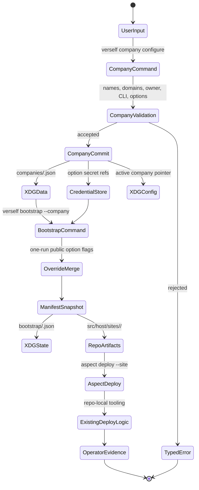
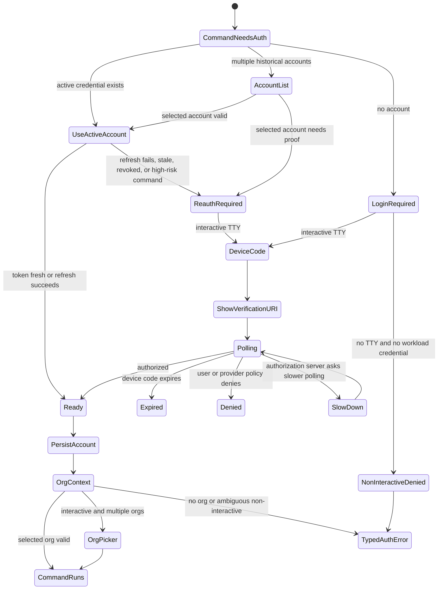
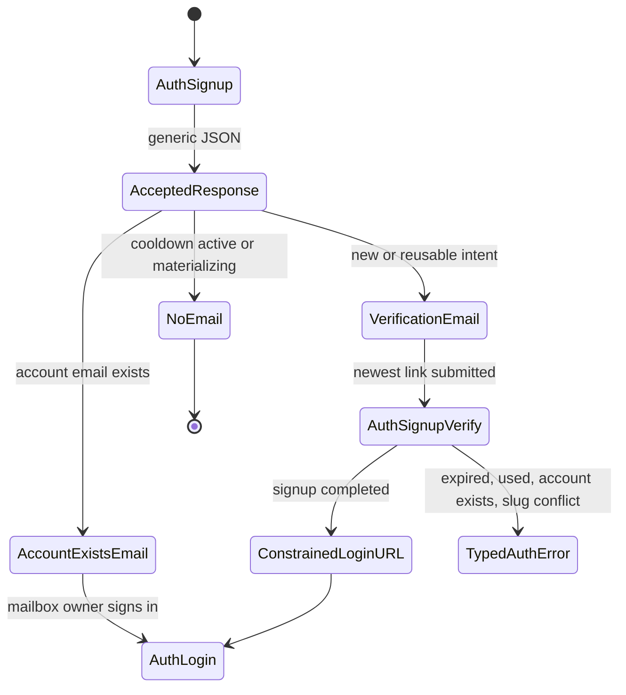

# Verself CLI

`verself` is the public CLI and SDK facade for hosted Verself APIs. It sits
above curated SDKs, which wrap public transport implementations for product services.
Browser server functions, the CLI, and customer automation use the same service
contracts with different auth flows and local state handling.

CLI borrows the Vercel command grammar where it fits: `verself orgs use`, `verself env pull`, and `whoami`. Semantics are different because Verself does not deploy customer applications. `verself deploy` is an operator-local checkout command for deploying this Verself installation, not a customer app deploy. We'll dogfood the CLI by using it to seed our organization and run automations. Auth context decides which surface a given command targets.

`aspect` remains the repo task runner for contributors and agents. `verself`
is the public product CLI. Operator-local commands can wrap selected `aspect`
tasks when running from a checkout.

## Layering

The command pipeline is:

```text
CLI command
  -> local profile and project resolution
  -> curated SDK operation
  -> SDK transport implementation
  -> service API
  -> service-owned PostgreSQL, Zitadel, SpiceDB, ClickHouse, or external adapter
```

Service calls go through SDK operations. Missing service behavior is added at
the Smithy contract layer, projected into OpenAPI where needed, and wrapped by
the SDK transport implementation.

## SDK Shape

The public SDK is credential-source-first. Hosted automation uses workload
identity when the runtime can prove its identity, and falls back to a credential
file when it cannot. Raw access-token construction is reserved for diagnostics
and tests.

```ts
import { Verself } from "@verself/sdk";

const verself = await Verself.fromWorkloadIdentity({
  org: "guardian-intelligence",
  provider: "github-actions",
});
```

Go follows the same semantics:

```go
client, err := verself.FromWorkloadIdentity(ctx, verself.WorkloadIdentityOptions{
	Org:      "guardian-intelligence",
	Provider: verself.WorkloadProviderGitHubActions,
})
if err != nil {
	return err
}
```

Credential files remain the fallback for runtimes without workload identity:

```ts
import { Verself } from "@verself/sdk";

const verself = await Verself.fromCredentialFile({
  org: "acme-corp",
  path: "/run/secrets/verself-credential.json",
});
```

The SDK exposes product resource modules. Backing services and generated
transport clients stay behind the curated facade:

```ts
const page = await verself.projects.list({ state: "active" });
const project = await verself.projects.create({
  displayName: "API",
  slug: "api",
}, {
  idempotencyKey: "project-create-api-2026-05-11",
});

const created = await verself.credentials.create({
  name: "e2e-acme",
  permissions: ["sandbox:execution:read", "sandbox:logs:read"],
  authMethod: "private_key_jwt",
});
```

The Go SDK is the same boundary for CLI and automation:

```go
page, err := client.Projects.List(ctx, verself.ListProjectsOptions{
	State: verself.ProjectStateActive,
	Limit: 100,
})
```

`baseURL` is the installation apex. Omitted `baseURL` means
`https://verself.sh`. SDKs and the CLI resolve service origins from
`{baseURL}/.well-known/verself`; service URL overrides are diagnostic inputs for
service-local development, staging tunnels, and temporary operator diagnostics.
Public examples omit service URL overrides.

## System Pieces

The CLI boundary has these major pieces:

| Piece | Owns |
| --- | --- |
| CLI facade | Command grammar, local profile resolution, interactive UX, JSON output, company option capture, and command orchestration. |
| Curated SDK | Auth, retries, idempotency keys, pagination, waiters, error normalization, trace propagation, and DTO conversion above public transport implementations. |
| XDG file store | Non-secret profiles, active context, cached discovery documents, and local locks across config, data, state, cache, and runtime directories. |
| Credential store | Machine credential bundles, provider tokens, and company option secret references used during local bootstrap. |
| Source-code-hosting-service | Repository storage, Git HTTP, checkout grants, archive resources, and signed download URLs. |
| Aspect task surface | Repo-local provisioning, host convergence, Nomad deployment, owner-claim preparation, Zitadel grant reconciliation, and post-deploy verification through checked-in tasks such as `aspect deploy`. |
| IAM service | Organization materialization, verified owner claim completion, Zitadel grants, and authorization graph convergence when invoked by repo-local operator/seeding logic. |
| Observability/audit | Trace propagation, ClickHouse evidence, service audit rows, and domain-event ledgers tied to operation IDs. |

Hosted service observability covers hosted API calls. Operator-local rendering
records local run state under XDG and emits the same trace context as the
service calls it precedes.

## Resource Model

Verself uses separate terms for deployment facts, product facts, and local CLI
state. Facades should render these terms consistently.

```text
local machine
  profile
    -> organization
       -> project
          -> repository

operator checkout
  site
    -> rendered site artifacts
```

| Term | Layer | Meaning |
| --- | --- | --- |
| Site | Repo/operator | A checked-in deployment environment such as `prod`, `beta`, `gamma`, or `dev-shovon`. It owns host vars, inventory, provisioning input, and catalog declarations under `src/host/sites/<site>/`. |
| Company | Business intent | The external business being created or operated. It supplies display name, owner identity, brand/domain intent, and billing/legal semantics. |
| Organization | Product tenant | The IAM, billing, policy, and membership boundary in hosted Verself. A company is represented by one primary organization. |
| Domain | DNS/resource | A DNS name attached to a company, organization, or service origin. `product_domain` names the hosted Verself product root; `company_domain` names the business. |
| Project | Product workspace | An organization-scoped workspace for source, deployments, workloads, environments, and product resources. |
| Repository | Source resource | A source-code-hosting-service repository attached to a project and exposed through Git HTTP, tree/blob APIs, and checkout grants. |
| Profile | Local CLI state | A local XDG-backed pointer to a Verself site and service origins. |
| Account | Local CLI state | A credential reference, subject metadata, and selected organization under one profile. |
| Company option | Local intent | A secret reference, non-secret config value, or structured provider field set owned by a company record and rendered into bootstrap artifacts when needed. |
| Bootstrap manifest | Render input | A resolved snapshot produced from the company store plus one-run public option overrides. |

Names map across layers during bootstrap:

| Input | Derived product value |
| --- | --- |
| `company.name` | organization display name, brand defaults, repository README copy |
| `company.domain` | owner email domain, organization name default, DNS template target |
| `owner.alias` | owner email local-part and owner-claim input |
| `cli.name` | generated CLI binary name and command examples |
| `product_domain` | hosted product root, auth origin, API origins, Git/source origin |
| `site` | local deployment environment used to materialize `src/host/sites/<site>/` |

This keeps customer-facing UX focused on hosted Verself resources. Operator
bootstrap commands can still materialize site artifacts from company intent, but
that workflow is documented as an operator surface.

## Resource Identifiers

CLI output for durable product resources includes an immutable `id`, a canonical
`resourceName`, an optional parent-scoped `slug`, and a mutable `displayName`.

| Field | CLI behavior |
| --- | --- |
| `id` | Stable opaque identifier accepted by commands for exact selection. |
| `resourceName` | Globally unique RFC 8141 URN used in JSON output, audit joins, imports, exports, and cross-resource flags. |
| `slug` | Human-friendly identifier unique under a parent resource while active. Slugs may change and keep redirect history. |
| `displayName` | Human label. Commands never use display names for identity resolution. |

Resource names follow the SDK resource identity contract:

```text
urn:verself:<installation-id>:<collection>/<resource-id>[/<collection>/<resource-id>...]
```

Initial resource name formats:

| Resource | Format |
| --- | --- |
| Organization | `urn:verself:<installation-id>:orgs/<org-id>` |
| Credential | `urn:verself:<installation-id>:orgs/<org-id>/credentials/<credential-id>` |
| Workload trust | `urn:verself:<installation-id>:orgs/<org-id>/workloadTrusts/<trust-id>` |
| Project | `urn:verself:<installation-id>:orgs/<org-id>/projects/<project-id>` |
| Environment | `urn:verself:<installation-id>:orgs/<org-id>/projects/<project-id>/environments/<environment-id>` |
| Repository | `urn:verself:<installation-id>:orgs/<org-id>/projects/<project-id>/repositories/<repository-id>` |
| Run | `urn:verself:<installation-id>:orgs/<org-id>/runs/<run-id>` |
| Run attempt | `urn:verself:<installation-id>:orgs/<org-id>/runs/<run-id>/attempts/<attempt-id>` |
| Schedule | `urn:verself:<installation-id>:orgs/<org-id>/schedules/<schedule-id>` |
| Secret | `urn:verself:<installation-id>:orgs/<org-id>/secrets/<secret-id>` |
| Transit key | `urn:verself:<installation-id>:orgs/<org-id>/transitKeys/<key-id>` |

The CLI accepts slugs for scoped flags such as `--org guardian-intelligence`
and `--project api`. Ambiguous, cross-resource, import/export, policy, and audit
commands should accept and emit resource names. Human-readable tables may show
slugs; JSON output must include the resource name whenever the resource is
durable.

Command flags that refer to a resource outside the command's active scope should
name the resource explicitly, for example `--target-resource-name`,
`--parent-resource-name`, `--credential-resource-name`, or
`--repository-resource-name`. Short aliases such as `--org` and `--project` may
accept IDs, slugs, or resource names because their target type is fixed by the
flag.

Duplicate active slugs under the same parent and resource type are conflicts.
Duplicate display names are allowed. If a create command retries with the same
idempotency key and body, the CLI prints the original resource. If the retry
changes the body, the CLI surfaces `conflict.idempotency_payload_mismatch`.

## Command Shape

Commands follow a small global grammar:

```text
verself [global flags] <noun> <verb> [args] [flags]
```

Global flags:

| Flag | Meaning |
| --- | --- |
| `--profile <name>` | Selects the local profile for endpoint and credential resolution. |
| `--org <id-or-slug-or-resource-name>` | Selects the organization for org-scoped operations. |
| `--project <id-or-slug-or-resource-name>` | Selects the project for project-scoped operations. |
| `--json` | Emits structured JSON without progress text. |
| `--no-color` | Disables ANSI styling. |
| `--cwd <path>` | Resolves project-local state from another working directory. |
| `--traceparent <value>` | Joins an existing distributed trace. |

Resolution order:

1. explicit command flags;
2. environment variables such as `VERSELF_PROFILE`, `VERSELF_ORG`, and
   `VERSELF_PROJECT`;
3. project-local `.verself/project.json`;
4. active profile defaults;
5. interactive selection when stdin is a terminal;
6. a typed ambiguity error.

When multiple valid organizations or projects exist, interactive commands
prompt and non-interactive commands return a typed ambiguity error.

## XDG State

The CLI uses XDG locations for durable local state. Platform adapters may map
these locations to native operating-system directories when the XDG variables
are unset, but the logical layout remains stable.

| Purpose | Directory | Default POSIX path | Contents |
| --- | --- | --- | --- |
| Config | `$XDG_CONFIG_HOME/verself` | `~/.config/verself` | Non-secret profile and CLI configuration. |
| State | `$XDG_STATE_HOME/verself` | `~/.local/state/verself` | Mutable command state, selected org/project history, bootstrap run records. |
| Data | `$XDG_DATA_HOME/verself` | `~/.local/share/verself` | Durable non-secret company records, downloaded discovery manifests, and plugin metadata. |
| Cache | `$XDG_CACHE_HOME/verself` | `~/.cache/verself` | Rebuildable caches: API discovery, org/project display-name cache, SDK schema cache. |
| Runtime | `$XDG_RUNTIME_DIR/verself` | process-local `0700` temp dir when unset | Locks, device-flow polling state, optional PKCE callback sockets, nonce files, and short-lived IPC. |

Directories are created with mode `0700`. Config and state files are written
with mode `0600` through an atomic write, fsync, and rename sequence. Commands
that mutate a profile acquire a per-profile lock under the runtime directory.

Secrets are stored through a credential-store abstraction. Platform adapters
may use native stores; the headless POSIX implementation writes owner-only
credential files under XDG state and stores opaque `verself-cred://` references
elsewhere.

| Platform | Store |
| --- | --- |
| macOS | Keychain |
| Linux desktop | Secret Service or KWallet |
| Windows | Credential Manager |
| Headless Linux | `$XDG_STATE_HOME/verself/credentials/*.secret` with mode `0600` |

XDG config/state/data/cache files remain free of refresh tokens, API
credentials, Cloudflare tokens, Latitude.sh tokens, Stripe secrets, webhook
secrets, and Zitadel admin material. Profiles and company records store only
credential references.

## Local State Chart

`verself company` is the write path for company intent and third-party options.
`verself bootstrap` reads a company record, applies one-run public option
overrides, and renders a run-specific manifest.



Durable local state is append-or-replace by resource kind: profiles, accounts,
and active context update XDG config/data, company records live under XDG data, run records
append under XDG state, cached discovery is rebuildable under XDG cache, and
secret material is stored by reference in the credential store or imported into
OpenBao runtime paths. Public bootstrap option overrides affect
the current run unless the user also writes them through `verself company`.

## Profile Model

A profile represents one hosted Verself site context.
Profiles are named with `[A-Za-z0-9_.-]+` and contain no path separators.
The default hosted profile points at `https://verself.sh` and refreshes
`https://verself.sh/.well-known/verself` before the first auth or API command.

`$XDG_CONFIG_HOME/verself/config.json`:

```json
{
  "version": 1,
  "active_profile": "guardian-prod",
  "profiles": {
    "guardian-prod": {
      "kind": "operator",
      "root_url": "https://verself.sh",
      "discovery_url": "https://verself.sh/.well-known/verself",
      "discovery_schema_version": 1,
      "installation_id": "inst_5NZSEA08R8P3HN566DNH8D301M",
      "auth_issuer": "https://verself.sh",
      "console_url": "https://verself.sh",
      "active_account": "acct_JAAJQjCf6N2hFf9vAnf9m8PL"
    },
    "local-bootstrap": {
      "kind": "bootstrap-local",
      "repo_root": "/home/ubuntu/Projects/verself-sh",
      "site": "prod"
    }
  }
}
```

`$XDG_DATA_HOME/verself/accounts/guardian-prod/acct_JAAJQjCf6N2hFf9vAnf9m8PL.json`:

```json
{
  "version": 1,
  "profile_name": "guardian-prod",
  "handle": "acct_JAAJQjCf6N2hFf9vAnf9m8PL",
  "account_id": "acct_JAAJQjCf6N2hFf9vAnf9m8PL",
  "issuer": "https://verself.sh",
  "subject": "287000000000000000",
  "email": "owner@example.com",
  "display_name": "Owner",
  "device_session_id": "sess_01J8QJ4P1R7S9W2X5M6N8P0Q2A",
  "credential_ref": "verself-cred://9f3c8cfd46e0d7d70c7567f11f1a0d78",
  "selected_org": {
    "org_id": "org_01J8QJ4P1R7S9W2X5M6N8P0Q2",
    "slug": "guardian-intelligence",
    "display_name": "Guardian Intelligence"
  }
}
```

Profile kinds:

| Kind | Use |
| --- | --- |
| `customer` | Normal API/console usage against hosted Verself. |
| `operator` | Human operator usage with access to operator-only APIs. |
| `bootstrap-local` | A checkout that can materialize company-derived site files and command metadata. |
| `ci` | Non-interactive profile using an API credential or workload credential. |

Selection commands:

```text
verself profiles list
verself profiles add guardian-prod --root-url https://verself.sh
verself profiles use guardian-prod
verself profiles inspect guardian-prod --json
verself profiles remove guardian-prod
```

`verself profiles add` performs service discovery from `root_url`, validates the
manifest schema, and stores installation metadata plus the auth issuer. Resolved
service endpoints live in the rebuildable discovery cache and are reloaded when
the manifest `schema_version`, `installation_id`, or cache TTL changes. A failed
discovery can be repaired with `verself profiles refresh <name>`.

## Project-Local State

`verself link` writes `.verself/project.json` in the repository or application
root:

```json
{
  "version": 1,
  "profile": "guardian-prod",
  "org": "guardianintelligence.org",
  "project": "verself",
  "root_directory": "."
}
```

This file is non-secret and may be committed by projects that want deterministic
deployment linkage. User-specific overrides belong in XDG profile config.

## Auth UX

Hosted auth resolves through profile, account, session, and organization
context. A profile stores site and service discovery state. An account under that
profile stores issuer/subject metadata, the display name, the Verself account
id, a credential reference, the device session id, and selected organization.
Product commands resolve active profile, active account, active session, then selected
organization. Multiple accounts for one Verself site remain explicit local state.



```text
verself login
verself signup owner@example.com --org "Acme" --slug acme
verself signup verify --url "$SIGNUP_URL"
verself whoami
verself accounts list
verself accounts use <handle|email|subject>
verself accounts logout [handle|email|subject]
verself sessions list
verself sessions revoke <session-id>
verself logout
```



`verself signup` starts an unauthenticated IAM signup intent. IAM sends a
verification email only for new or reusable signup intents and creates no
Zitadel user, organization, SpiceDB relationship, or product account until
`verself signup verify` submits the verification token. The SDK derives
mutation idempotency keys; CLI users and forms do not provide them for signup.
Signup starts always emit a generic JSON `message` so the command does not
reveal whether an email already exists. When the mailbox already belongs to an
account, IAM sends an account-exists notice instead of a verification link.
Repeated starts for an address with a reusable pending intent send the newest
link for the same intent after a short per-email cooldown; rapid repeats return
the same accepted response without another email. After verification, the
response includes a constrained browser login URL so a browser already signed
into a different account is asked to select the intended account.

`verself login` is an interactive human login command. It discovers the
hosted issuer from the active profile, starts the OAuth device authorization
grant, prints the verification URI and user code, polls with server-provided
intervals, persists the resulting account/session in the credential store, and
selects an accessible organization when the choice is unambiguous.
Non-interactive invocations fail with a typed auth error unless a workload
credential or customer API credential is configured.

`verself accounts use` validates the selected account before switching. A
stale, revoked, or higher-assurance account enters the reauth path instead of
becoming active. `verself logout` and `verself sessions revoke` revoke
remote session evidence before deleting local references when the issuer exposes
revocation metadata.

Signup-flow mailboxes are provisioned and cleaned up through operator tasks:

```text
aspect mail test-accounts ensure
aspect mail test-accounts list
aspect mail test-accounts delete
```

The test-account set includes ordinary and uncommon spec-compliant local parts
such as plus tags, dotted names, quoted-safe punctuation, percent signs, and
question marks. Plus-tagged test addresses use the base Stalwart delivery
principal because Stalwart subaddressing delivers `user+tag@domain` to
`user@domain`; the plus-tagged address is also installed as an alias on that
principal. `delete` removes the Stalwart principals, local mailbox credentials,
and product rows associated with those test emails.

Organization invites use the authenticated IAM member invite API and the public
invite acceptance API:

```text
verself orgs members invite teammate@example.com --role roles/admin
```

The invite email points at the console invite page. CLI automation can consume
the same acceptance token through the Smithy-modeled IAM operation when an agent
controls the mailbox used for testing.

Workload trust is the preferred path for CI, Verself runners, agents, and
self-hosted runtimes that can present their own identity. Interactive CLI login
uses OAuth device code, then mints a Verself device session. Customer API
credentials are the portable automation path for runtimes without workload
identity. SDK-backed commands read the active auth profile, active account, and
device session by default. Command-level service-origin overrides exist for
diagnostics and isolated local development.

## Public Command Surface

The CLI borrows command grammar from Vercel where it fits: `whoami`, `link`,
`env pull`, and `orgs use`. The target public surface targets hosted Verself
APIs and sandbox-compute product resources. Verself sells sandbox compute rather
than application hosting, so hosted public commands manage organizations,
projects, environments, source resources, credentials, billing, logs, and
sandbox workloads.

```text
verself login
verself signup
verself signup verify
verself profiles list|add|use|inspect|refresh|remove
verself login|whoami|logout
verself accounts list|use|logout
verself sessions list|revoke
verself connections list|link|remove
verself credentials list|create|inspect|rotate|revoke
verself credentials trust list|create|inspect|delete
verself orgs list|create|use|inspect|update
verself orgs members list|invite|update|remove
verself projects list|create|inspect|update|archive
verself repos list|inspect|checkout-grants|workflow-runs
verself runs list|inspect|logs
verself env list|set|get|pull|run
verself notifications list|summary|dismiss|clear|preferences
verself audit api-activities|exports
verself billing entitlements|plans|contracts|statement
```

`auth connections` is the target account-linking surface for GitHub and future
OIDC providers after the device-login and session-registry work lands.

`teams` can be accepted as an alias for `orgs` for migration ergonomics:

```text
verself teams list
verself teams switch guardianintelligence.org
```

Aliases should be visible in help output and share the same implementation as
the canonical command.

## Environment UX

`verself env` follows Vercel's project-scoped environment variable shape. The
primary compatible flows are pulling variables into a file and running a command
with fetched variables:

```text
verself env pull .env.verself --org guardianintelligence.org --project api --environment production
verself env run --org guardianintelligence.org --project api --environment preview -- npm test
```

Every environment command requires an unambiguous organization, project, and
environment from flags, project linkage, or active profile state.

## Company UX

[The below has been descoped]

`verself company` is an operator-local surface. It owns the durable local data
store for company intent and third-party options. Bootstrap reads this store and
accepts one-run public option overrides for the current render.

```text
verself company configure guardian \
  --site prod \
  --product-domain verself.sh \
  --company-domain guardianintelligence.org \
  --company-name "Guardian Intelligence" \
  --owner-alias shovon \
  --owner-name "Shovon Hasan" \
  --cli-name guardian

verself company use guardian
verself company inspect guardian --json
```

Company options are supplied through stdin, explicit non-secret values, or
structured field sets:

```text
verself company options add guardian cloudflare.account_admin_a --stdin < /secure-handoff/cloudflare-account-admin-a
verself company options add guardian cloudflare.account_admin_b --stdin < /secure-handoff/cloudflare-account-admin-b
verself company options add guardian latitude.api_token --stdin < /secure-handoff/latitude-api-token
verself company options set guardian latitude.project_id --value <project-id>
verself company options set guardian latitude.region --value ASH
verself company options set guardian latitude.plan --value f4-metal-medium
verself company options add guardian stripe.secret_key --stdin < /secure-handoff/stripe-secret-key
verself company options add guardian stripe.webhook_secret --stdin < /secure-handoff/stripe-webhook-secret
verself company options set guardian stripe.publishable_key --value <publishable-key>
verself company options set guardian stripe.default_currency --value usd
```

Token-valued command-line flags are avoided because shells record argv in
history and process listings. Secret-valued options use `--stdin`, a
credential-store prompt, or controller OpenBao import.

`company configure` writes the shared local store:

- company records under `$XDG_DATA_HOME/verself/companies/<company>.json`;
- active company pointer under `$XDG_CONFIG_HOME/verself/config.json`;
- credential references in the company record;
- secret values in the credential store or controller OpenBao import when
  explicitly requested.

For Guardian, the company record derives these seeding inputs:

| Field | Value |
| --- | --- |
| Owner email | `shovon@guardianintelligence.org` |
| Organization name | `guardianintelligence.org` |
| Company domain | `guardianintelligence.org` |
| Trust tier | `platform` |

## Bootstrap UX [DESCOPED]

[The below has been descoped]

`verself bootstrap` is an operator-local command that resolves a company record
into repo-local artifacts. It can take one-run public option overrides, but
durable configuration changes go through `verself company`. Secret-valued inputs
are refused in `bootstrap --set` and must be supplied through
`verself company options add`.

```text
verself bootstrap --company guardian
verself bootstrap --company guardian --site prod
verself bootstrap --company guardian --set latitude.region=ASH
verself bootstrap --company guardian --option stripe.default_currency=usd
```

`bootstrap` writes the local render outputs for a checkout:

- `.verself/bootstrap/manifest.yaml`;
- `src/host/sites/<site>/vars.yml`;
- `src/host/sites/<site>/provisioning.tfvars.json.template`;
- `src/<cli_name>-cli/` when rendering a named CLI;
- bootstrap run records under `$XDG_STATE_HOME/verself/bootstrap/<run-id>.json`.

Out of scope for `verself bootstrap`:

- provider mutation;
- infrastructure provisioning;
- host convergence;
- service deployment;
- owner claim preparation;
- IAM/Zitadel grant seeding.

Those actions stay in checked-in repo tooling such as `aspect deploy` and
operator tasks that consume the same company record and resolved manifest.

## Company Options [DESCOPED]

Company options are the shared interface for all third-party and generated
configuration needed by operator bootstrap. The same schema covers
pre-provisioning infrastructure inputs and runtime integrations that may become
necessary after the first deploy.

An option has:

| Field | Meaning |
| --- | --- |
| `name` | Stable semantic name when the value cannot be classified from shape alone. |
| `source` | `stdin`, `credential_store`, `openbao`, `literal`, or `generated`. |
| `sensitivity` | `secret`, `confidential`, or `public`. |
| `value_ref` | Redacted local reference, never the raw secret. |
| `classification` | Derived provider, kind, capability set, and confidence. |
| `purpose` | `infrastructure`, `runtime_integration`, `identity`, `notification`, `billing`, or `backup`. |
| `render_targets` | Site vars, provisioning tfvars, OpenBao runtime path, bootstrap manifest, README, or service config template. |
| `required_by` | Phase, command surface, or service capability that cannot run without this option. |

Opaque credentials are classified from value shape, semantic option name, and
structured field names. Multi-field integrations use the same option shape with
`fields` instead of `secret`. Ambiguous values produce
`company_option.unclassified` and require a semantic option name.

Initial local rendering has no hard runtime integration requirement. Every
third-party runtime integration the deployed installation needs still belongs
in the option catalog so operator artifacts can include the right OpenBao
targets, service config keys, and verification commands.

Initial option catalog:

| Area | Options | Required by |
| --- | --- | --- |
| Compute | Latitude.sh API token, project ID, region, plan, SSH key policy | Checked-in provisioning task before `aspect deploy` |
| DNS and TLS | Cloudflare account-admin pair, account ID, hosted-zone names, DNS zone intent | Prod control-plane DNS reconciliation; explicit public-edge certificate issuance |
| Backups | AWS S3 access key ID, secret access key, region, bucket, prefix, retention policy | Backup verification and scheduled backup jobs |
| Billing | Stripe secret key, publishable key, webhook signing secret, account mode, price/catalog mapping | Billing service payment and webhook handling |
| Outbound email | Email-service provider secret, sender domain, default sender address | Email verification, invites, notifications, and company addresses |
| Identity | Zitadel admin bootstrap material, OIDC issuer defaults, post-deploy owner claim | Operator seeding task and Zitadel grant reconciliation after `aspect deploy` |

Adding a third-party integration starts by adding an option schema with
sensitivity, classifier evidence, validation, render targets, consuming service,
and verification evidence. Service code then consumes generated config through
the normal service runtime and never through CLI-only shortcuts.

Secret-valued options store metadata and a local `value_ref` only for operator
handoff. Runtime plaintext lives in catalog-approved OpenBao targets.

Site root keys and unseal material are scoped to the target site. Global
provider authorities such as Cloudflare DNS/TLS live in the prod controller and
project derived state to target sites. Runtime services authenticate to OpenBao
with SPIFFE JWT-SVIDs mapped to scoped policies.

## Derivation Rules [DESCOPED]

The bootstrap manifest stores a resolved snapshot of company input, one-run
public option overrides, company options, and derived values separately:

```yaml
version: verself.bootstrap.v1
site: prod
inputs:
  product_domain: verself.sh
  company_domain: guardianintelligence.org
  company_name: Guardian Intelligence
  owner_alias: shovon
  owner_name: Shovon Hasan
  repository_slug: verself
company_options:
  - name: latitudesh-auth-token
    source: stdin
    sensitivity: secret
    provider: latitude
    kind: api_token
    purpose: infrastructure
    render_targets:
      - openbao://kv-runtime/secret/org/latitude.api_token
    required_by: infrastructure.provisioning
  - name: stripe-secret-key
    source: stdin
    sensitivity: secret
    provider: stripe
    kind: secret_key
    purpose: billing
    render_targets:
      - openbao://kv-runtime/secret/org/billing-service.stripe.secret_key
    required_by: billing-service.runtime
derived:
  owner_email: shovon@guardianintelligence.org
  organization_name: guardianintelligence.org
  company_slug: guardian-intelligence
  company_display_name: Guardian Intelligence
  zitadel_domain: verself.sh
  iam_service_domain: iam.api.verself.sh
  sandbox_rental_service_domain: sandbox.api.verself.sh
  forgejo_domain: git.verself.sh
```

Derived locally:

- email addresses from alias and company domain;
- public origins from the product domain and service subdomain catalog;
- slugs from explicit values or normalized display names;
- DNS desired state from the site record catalog;
- stable product UUIDs for repo-owned project/repository/backend records;
- OIDC redirect/logout URLs from service origins.

Resolved by later provisioning and reconciliation commands:

- Cloudflare zone IDs;
- Latitude.sh server IDs and public IP addresses;
- runtime integration account metadata when a local verify command explicitly
  validates an option;
- Zitadel organization, project, application, and authorization IDs;
- Forgejo repository numeric IDs;
- OpenBao secret values and key material.

Generated by bootstrap rendering:

- OpenBao runtime secret declarations and generated bootstrap evidence;
- bootstrap run identifiers;
- rendered artifact manifest hashes.

## Site Artifacts [DESCOPED]

`verself bootstrap` resolves a company record into the operator checkout. It
writes the artifacts the operator's `aspect deploy` will consume:

| Path | Purpose |
| --- | --- |
| `.verself/bootstrap/manifest.yaml` | Canonical bootstrap manifest with company, owner, CLI, site, domain, and provider capability metadata. |
| `src/<cli_name>-cli/` | CLI package or build target that emits the chosen command name. |
| `src/host/sites/<site>/vars.yml` | Rendered site variables, domains, service origins, and canary defaults. |
| `src/host/sites/<site>/provisioning.tfvars.json.template` | Latitude/OpenTofu input template with provider-specific placeholders. |
| `README.md` | Operator next commands using `<cli_name>`, owner email, organization name, and selected site. |

The operator-local flow is:

```text
./src/tools/dev/bootstrap/bootstrap-linux-amd64
export PATH="${HOME}/.cache/verself/bootstrap-bin:${PATH}"
bazelisk build //src/<cli_name>-cli:<cli_name>
./bazel-bin/src/<cli_name>-cli/<cli_name> company inspect <company> --json
./bazel-bin/src/<cli_name>-cli/<cli_name> env run --org <org> --project <project> --environment bootstrap -- aspect deploy --site=prod --sha=HEAD
```

## Operation Errors

SDK-backed service commands return typed errors normalized from RFC 9457 Problem
Details. Operator-local render commands use the same `errors` array shape for
field-, render-, artifact-, or step-specific failures.

Render operation states:

```text
accepted
planning
classifying_options
rendering_artifacts
artifacts_ready
failed
canceling
canceled
```

Step states:

```text
pending
running
succeeded
warning
failed
skipped
```

Every operation response may include `errors`. The facade keys on `code` and
`step_id`; it treats `message` as fallback copy.

```json
{
  "type": "urn:verself:problem:bootstrap:render-failed",
  "title": "Render failed",
  "status": 422,
  "detail": "The bootstrap request could not be rendered.",
  "instance": "urn:verself:trace:4bf92f3577b34da6a3ce929d0e0e4736",
  "errors": [
    {
      "code": "validation.cli_name_invalid",
      "severity": "fatal",
      "step_id": "validate-input",
      "message": "CLI name must contain lowercase letters, numbers, and hyphens.",
      "field": "/cli/name",
      "retryable": false,
      "user_action": "Choose a CLI name such as guardian or acme."
    }
  ]
}
```

Error detail fields:

| Field | Meaning |
| --- | --- |
| `code` | Stable machine code. Facades map this to rich UX. |
| `severity` | `info`, `warning`, or `fatal`. |
| `step_id` | Operation step that produced or owns the error. |
| `message` | Human fallback copy for unknown clients. |
| `field` | JSON pointer to invalid request input when applicable. |
| `artifact` | Generated artifact path involved in the failure. |
| `resource` | Redacted Verself resource identifier. |
| `retryable` | The same request may succeed later without input changes. |
| `user_action` | Short action text for fallback UX. |
| `docs_url` | Deep link for long-form remediation. |
| `trace_id` | Trace ID when the error was produced by a specific span. |
| `details` | Typed, redacted render or service metadata. |

Stable code families:

| Family | Example codes |
| --- | --- |
| `validation.*` | `validation.domain_invalid`, `validation.owner_alias_invalid`, `validation.cli_name_invalid`, `validation.site_invalid` |
| `render.*` | `render.manifest_failed`, `render.site_vars_failed`, `render.cli_entrypoint_failed`, `render.readme_failed` |
| `source.*` | `source.repository_create_failed`, `source.archive_failed`, `source.archive_expired` |
| `storage.*` | `storage.artifact_write_failed`, `storage.artifact_hash_failed` |
| `company_option.*` | `company_option.unclassified`, `company_option.unsupported_shape` |

Error payloads never include raw provider tokens, authorization headers,
cookies, webhook secrets, private keys, signed download tokens, or unredacted
provider response bodies. Provider identifiers in `resource` and `details` are
safe display identifiers or hashes.

## Owner Seeding

The owner-claim flow belongs to `iam-service` and repo-local operator/seeding
logic. It consumes the company record and resolved manifest after services are
deployed by `aspect deploy`.

A seeding request creates a pending claim:

```json
{
  "site": "prod",
  "org_name": "guardianintelligence.org",
  "owner_email": "shovon@guardianintelligence.org",
  "trust_tier": "platform"
}
```

During constrained login or owner-claim completion, IAM verifies:

- the OIDC token issuer and audience;
- the browser nonce and PKCE state, or the issuer-confirmed device grant result;
- `email_verified == true`;
- the normalized email matches a pending claim;
- the claim is active, unexpired, and unclaimed.

IAM then:

- materializes the product organization profile;
- records the trust tier;
- grants owner authorization in the Zanzibar graph;
- records audit and domain-event evidence;
- appends the Verself public organization ID to subsequent provider tokens.

The member-management API owns invitation and removal. IAM policy APIs own
authorization bindings for humans, service accounts, workloads, and usersets.
The owner-claim command has narrower input and stronger preconditions than
normal organization membership.

## Security Controls

- Profile and account config store no bearer tokens, refresh tokens, provider
  tokens, or admin credentials. Account config stores only a credential
  reference and non-secret subject/org metadata.
- Provider tokens enter company options through stdin, OS credential stores, or
  catalog-approved OpenBao imports.
- Runtime generated secrets use OpenBao transit/random and stay in OpenBao.
- Secret updates use stdin, credential-store prompts, or OpenBao import
  commands. `--value` is reserved for non-secret options.
- The Zitadel admin PAT is consumed by `iam-service`, component reconcilers, and
  repo-local operator/seeding logic; routine CLI commands call service APIs.
- Mutating commands set idempotency keys through SDK middleware.
- Every service request carries trace context; service-side audit and ClickHouse
  evidence are the durable completion record.
- Interactive commands refuse ambiguous org/project selection.
- Non-interactive commands fail when required profile, org, or project context
  is missing.
- If token-file ingestion is retained, token files require owner-only
  permissions and are opened as regular files.
- CLI logs and errors redact tokens, authorization headers, cookies, signed
  URLs, and webhook secrets.
- Runtime files are created under a `0700` directory and removed after the
  command exits.

## Testing

CLI implementation should have deterministic tests for:

- XDG path resolution and directory permissions;
- profile precedence and ambiguity errors;
- credential-store references without secret leakage into config files;
- project-local `.verself/project.json` resolution;
- company record writes under XDG data and active company pointer updates under
  XDG config;
- company option classification without leaking raw credential material;
- secret-valued company option behavior, including no plaintext in default JSON
  or progress output;
- generated next-command output that uses `aspect deploy` for deployment;
- Smithy/OpenAPI-derived request shapes for SDK-backed commands;
- idempotency key generation and retry behavior for mutating commands;
- JSON output stability for automation.

Live SDK and CLI coverage should exercise:

- `verself projects list` and `verself projects create` through the Go SDK;
- the Go SDK `Projects` client using the public transport path without importing service-local clients;
- TypeScript server functions in `verself-web` using the TypeScript SDK;
- idempotency keys on project mutations;
- service-side API-activity/domain-event rows and ClickHouse traces for each live
  request.

Completion evidence for SDK-backed work is the combination of API JSON output,
service API activities, domain-event ledger rows, and traces linked by the same
trace ID.
