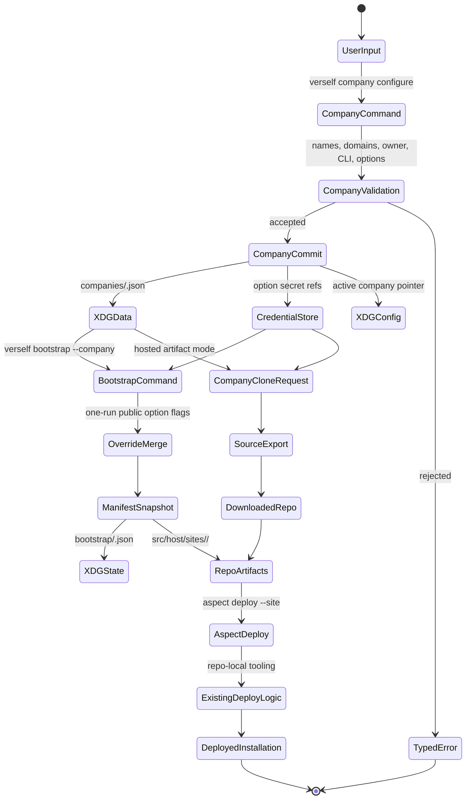

# Verself CLI

`verself` is the customer, operator, and bootstrap facade for the Verself
platform. It sits above the curated SDKs, which wrap generated OpenAPI clients
for product services. Browser server functions, the CLI, and customer
automation use the same service contracts with different auth flows and local
state handling.

The CLI has three execution surfaces:

- service mode: authenticated commands call public or SPIFFE-only service APIs
  through SDK packages;
- company mode: commands write durable local company records and secret
  references under XDG and the credential store;
- bootstrap mode: commands read a company record, apply one-run public option
  overrides, and materialize repo/site artifacts.

`aspect` remains the repo task runner for contributors and agents. `verself`
becomes the public product CLI and can wrap selected `aspect` tasks when it is
running from a checkout.

## Layering

The command pipeline is:

```text
CLI command
  -> local profile and project resolution
  -> curated SDK operation
  -> generated OpenAPI client
  -> service API
  -> service-owned PostgreSQL, Zitadel, SpiceDB, ClickHouse, or external adapter
```

Service calls go through SDK operations. Missing service behavior is added at
the Huma route/OpenAPI layer, regenerated into clients, and wrapped by the SDK.

Bootstrap has a bounded artifact path:

```text
company input
  -> company store
  -> public option overrides
  -> resolved manifest
  -> site files, encrypted SOPS bags, and generated command metadata
  -> bootstrap run record or repository export
```

Bootstrap writes files under `src/host/sites/<site>/`, emits a run record, and
stops at artifact generation. Provisioning, deployment, and owner-grant seeding
stay on checked-in repo tooling such as `aspect deploy` and operator tasks.

A bootstrapped company is an independent Verself installation. Hosted Verself
does not become its control plane, identity provider, billing backend, source
host, secret manager, deployment orchestrator, or operational authority. The
hosted service renders and exports a configured repo; after download, the
customer controls the repo, keys, provider accounts, domains, infrastructure,
runtime services, backups, and organization data.

`verself-sh` is the seed codebase for the generated company. The customer's
post-bootstrap substrate is their own Latitude bare metal, provider accounts,
domains, and SOPS keys. Verself's production installation does not host,
orchestrate, bill, observe, back up, or administer the generated installation
after export.

## System Pieces

The CLI boundary has these major pieces:

| Piece | Owns |
| --- | --- |
| CLI facade | Command grammar, local profile resolution, interactive UX, JSON output, company option capture, and command orchestration. |
| Curated SDK | Auth, retries, idempotency keys, pagination, waiters, error normalization, trace propagation, and DTO conversion above generated clients. |
| XDG file store | Non-secret profiles, company records, active context, bootstrap run records, cached discovery documents, and local locks across config, data, state, cache, and runtime directories. |
| Credential store | OAuth refresh tokens, API credentials, provider tokens, and company option secret values when they are not rendered into SOPS bags. |
| Company store | Durable local company intent, owner defaults, CLI name, site defaults, provider options, runtime integration options, and secret references. |
| Bootstrap manifest | Resolved snapshot of company, owner, site, domain, CLI, provider, and runtime integration intent. |
| Site artifact renderer | `src/host/sites/<site>/` files, provisioning templates, encrypted SOPS bags, README instructions, and generated CLI entrypoints. |
| Hosted company-clone service | Artifact-only API that renders a configured repository and asks source-code-hosting-service for an export URL. |
| Source-code-hosting-service | Repository storage, Git HTTP, checkout grants, archive/export resources, and signed download URLs. |
| Aspect task surface | Repo-local provisioning, host convergence, Nomad deployment, owner-claim preparation, Zitadel grant reconciliation, and post-deploy verification through checked-in tasks such as `aspect deploy`. |
| IAM service | Organization materialization, verified owner claim completion, Zitadel grants, and authorization graph convergence when invoked by repo-local operator/seeding logic. |
| Host/provisioning layer | Latitude/OpenTofu inputs, Cloudflare DNS inputs, SOPS bags, Ansible host convergence, Nomad deployment, and post-deploy verification consumed after bootstrap rendering. |
| Observability/audit | Trace propagation, ClickHouse evidence, service audit rows, and domain-event ledgers tied to operation IDs. |

Hosted observability and audit evidence covers only the render/export operation.
The customer's cloned installation writes its own telemetry and audit evidence
after it is deployed.

## Resource Model

Verself uses separate terms for deployment facts, product facts, and local CLI
state. Facades should render these terms consistently.

```text
local machine
  profile
    -> installation
       -> organization
          -> project
             -> repository

checkout bootstrap
  site
    -> rendered repo/site artifacts

company clone operation
  company intent + company options
    -> repository export
```

| Term | Layer | Meaning |
| --- | --- | --- |
| Installation | Product/runtime | One running Verself control plane reachable at a root URL, for example `https://verself.sh`. It has service origins, an auth issuer, and product APIs. |
| Site | Repo/operator | A checked-in deployment environment such as `prod`, `beta`, `gamma`, or `dev-shovon`. It owns host vars, inventory, provisioning input, and SOPS bags under `src/host/sites/<site>/`. |
| Company | Business intent | The external business being created or operated. It supplies display name, owner identity, brand/domain intent, and billing/legal semantics. |
| Organization | Product tenant | The IAM, billing, policy, and membership boundary inside an installation. A company is represented by one primary organization in an installation. |
| Domain | DNS/resource | A DNS name attached to an installation, company, organization, or service origin. `product_domain` names the Verself installation; `company_domain` names the business. |
| Project | Product workspace | An organization-scoped workspace for source, deployments, workloads, environments, and product resources. |
| Repository | Source resource | A source-code-hosting-service repository attached to a project and exposed through Git HTTP, tree/blob APIs, checkout grants, and exports. |
| Profile | Local CLI state | A local XDG-backed pointer to one installation, credential reference, and optional default organization/project. |
| Company option | Local intent | A secret reference, non-secret config value, or structured provider field set owned by a company record and rendered into bootstrap artifacts when needed. |
| Bootstrap manifest | Render input | A resolved snapshot produced from the company store plus one-run public option overrides. |
| Clone | Operation/artifact | A company-clone workflow that renders a downloadable company repository and bootstrap artifacts. Provisioning and seeding are separate command surfaces. |

Names map across layers during bootstrap:

| Input | Derived product value |
| --- | --- |
| `company.name` | organization display name, brand defaults, repository README copy |
| `company.domain` | owner email domain, organization name default, DNS template target |
| `owner.alias` | owner email local-part and owner-claim input |
| `cli.name` | generated CLI binary name and command examples |
| `product_domain` | installation root, auth origin, API origins, Git/source origin |
| `site` | local deployment environment used to materialize `src/host/sites/<site>/` |

This keeps customer-facing UX simple: the founder starts with a company and
keys; the platform materializes a configured repository. The downloaded repo
contains the inputs that `aspect deploy` and operator tasks can execute.

## Command Shape

Commands follow a small global grammar:

```text
verself [global flags] <noun> <verb> [args] [flags]
```

Global flags:

| Flag | Meaning |
| --- | --- |
| `--profile <name>` | Selects the local profile for endpoint and credential resolution. |
| `--org <id-or-slug>` | Selects the organization for org-scoped operations. |
| `--project <id-or-slug>` | Selects the project for project-scoped operations. |
| `--json` | Emits structured JSON without progress text. |
| `--no-color` | Disables ANSI styling. |
| `--cwd <path>` | Resolves project-local state from another working directory. |
| `--traceparent <value>` | Joins an existing distributed trace. |

Resolution order:

1. explicit command flags;
2. environment variables such as `VERSELF_PROFILE`, `VERSELF_ORG`, and
   `VERSELF_PROJECT`;
3. project-local `.verself/project.json`;
4. active profile defaults;
5. interactive selection when stdin is a terminal;
6. a typed ambiguity error.

When multiple valid organizations or projects exist, interactive commands
prompt and non-interactive commands return a typed ambiguity error.

## XDG State

The CLI uses XDG locations for durable local state. Platform adapters may map
these locations to native operating-system directories when the XDG variables
are unset, but the logical layout remains stable.

| Purpose | Directory | Default POSIX path | Contents |
| --- | --- | --- | --- |
| Config | `$XDG_CONFIG_HOME/verself` | `~/.config/verself` | Non-secret profile and CLI configuration. |
| State | `$XDG_STATE_HOME/verself` | `~/.local/state/verself` | Mutable command state, selected org/project history, bootstrap run records. |
| Data | `$XDG_DATA_HOME/verself` | `~/.local/share/verself` | Durable non-secret company records, downloaded discovery manifests, and plugin metadata. |
| Cache | `$XDG_CACHE_HOME/verself` | `~/.cache/verself` | Rebuildable caches: OpenAPI discovery, org/project display-name cache, SDK schema cache. |
| Runtime | `$XDG_RUNTIME_DIR/verself` | process-local `0700` temp dir when unset | Locks, auth callback sockets, PKCE state, nonce files, and short-lived IPC. |

Directories are created with mode `0700`. Config and state files are written
with mode `0600` through an atomic write, fsync, and rename sequence. Commands
that mutate a profile acquire a per-profile lock under the runtime directory.

Secrets are stored through a credential-store abstraction. Platform adapters
may use native stores; the headless POSIX implementation writes owner-only
credential files under XDG state and stores opaque `verself-cred://` references
elsewhere.

| Platform | Store |
| --- | --- |
| macOS | Keychain |
| Linux desktop | Secret Service or KWallet |
| Windows | Credential Manager |
| Headless Linux | `$XDG_STATE_HOME/verself/credentials/*.secret` with mode `0600` |

XDG config/state/data/cache files remain free of refresh tokens, API
credentials, Cloudflare tokens, Latitude.sh tokens, Stripe secrets, webhook
secrets, and Zitadel admin material. Profiles and company records store only
credential references.

## Local State Chart

`verself company` is the write path for company intent and third-party options.
`verself bootstrap` reads a company record, applies one-run public option
overrides, and renders a run-specific manifest.



Durable local state is append-or-replace by resource kind: profiles and active
context update XDG config, company records live under XDG data, run records
append under XDG state, cached discovery is rebuildable under XDG cache, and
secret material is stored by reference in the credential store or rendered into
site SOPS bags. Public bootstrap option overrides affect the current run unless
the user also writes them through `verself company`.

## Profile Model

A profile represents one Verself installation plus one local account context.
Profiles are named with `[A-Za-z0-9_.-]+` and contain no path separators.

`$XDG_CONFIG_HOME/verself/config.json`:

```json
{
  "version": 1,
  "active_profile": "guardian-prod",
  "profiles": {
    "guardian-prod": {
      "kind": "operator",
      "root_url": "https://verself.sh",
      "discovery_url": "https://verself.sh/.well-known/verself",
      "auth_issuer": "https://auth.verself.sh",
      "console_url": "https://verself.sh",
      "credential_ref": "verself://profiles/guardian-prod/oauth",
      "default_org": "guardianintelligence.org",
      "default_project": "verself"
    },
    "local-clone": {
      "kind": "bootstrap-local",
      "repo_root": "/home/ubuntu/Projects/verself-sh",
      "site": "prod"
    }
  }
}
```

Profile kinds:

| Kind | Use |
| --- | --- |
| `customer` | Normal API/console usage against a Verself installation. |
| `operator` | Human operator usage with access to operator-only APIs. |
| `bootstrap-local` | A checkout that can materialize company-derived site files and command metadata. |
| `ci` | Non-interactive profile using an API credential or workload credential. |

Selection commands:

```text
verself profiles list
verself profiles add guardian-prod --root-url https://verself.sh
verself profiles use guardian-prod
verself profiles inspect guardian-prod --json
verself profiles remove guardian-prod
```

`verself profiles add` performs service discovery from `root_url` and stores the
resolved endpoints. A failed discovery can be repaired with `verself profiles
refresh <name>`.

## Project-Local State

`verself link` writes `.verself/project.json` in the repository or application
root:

```json
{
  "version": 1,
  "profile": "guardian-prod",
  "org": "guardianintelligence.org",
  "project": "verself",
  "root_directory": "."
}
```

This file is non-secret and may be committed by projects that want deterministic
deployment linkage. User-specific overrides belong in XDG profile config.

## Auth UX

Interactive auth:

```text
verself auth login
verself auth logout
verself auth whoami
verself auth token --audience iam-service
```

`auth login` uses OAuth device authorization when the server supports it and
authorization code with PKCE otherwise. PKCE verifiers, nonce values, and local
callback listener state live only under the runtime directory. Refresh tokens
are stored in the credential store. Access tokens are held in process memory
and refreshed as needed.

Headless auth:

```text
VERSELF_TOKEN=... verself deploy --profile ci --json
verself auth login --token-file /run/secrets/verself-token
```

Token files must be regular files with owner-only permissions. The CLI refuses
world-readable token files.

## Public Command Surface

The CLI borrows command grammar from Vercel — `auth login`, `whoami`, `link`,
`env pull`, `orgs use` — because the ergonomics are good and operators arrive
with that vocabulary. Product semantics differ. Verself does not run an
application-hosting product, so commands such as `verself deploy` do not push a
customer-authored application to `verself.sh`; they run against the active
profile's installation, which is `verself.sh` for sandbox-rental customers and
the operator's own apex for cloned installations. Deploys against a cloned
installation are still executed by that installation's repo-local
`aspect deploy`; the CLI surfaces it as a single command for ergonomics.

```text
verself login
verself whoami
verself switch
verself link
verself deploy
verself pull
verself env ls|add|get|rm|pull|run
verself domains ls|add|rm|verify
verself projects ls|create|inspect|update|rm
verself orgs ls|create|use|inspect|update
verself orgs members ls|invite|update|remove
verself logs
verself billing status
verself iam policies get|set|add-binding|remove-binding
verself iam test-permissions
verself company list|configure|use|inspect|remove
verself company options list|add|set|remove
verself company secret list|generate|reveal|set|remove
```

`teams` can be accepted as an alias for `orgs` for migration ergonomics:

```text
verself teams list
verself teams switch guardianintelligence.org
```

Aliases should be visible in help output and share the same implementation as
the canonical command.

## Environment UX

`verself env` follows Vercel's project-scoped environment variable shape while
adding an explicit single-key reveal command. The primary compatible flows are
pulling variables into a file and running a command with fetched variables:

```text
verself env pull .env.verself --org guardianintelligence.org --project verself --environment bootstrap
verself env run --org guardianintelligence.org --project verself --environment bootstrap -- aspect deploy --site=prod --sha=HEAD
```

`env get` is a Verself extension for explicit single-secret reveal:

```text
verself env get VERSELF_SOPS_AGE_IDENTITY \
  --org guardianintelligence.org \
  --project verself \
  --environment bootstrap
```

`env get` is terminal-only by default for secret values. Non-interactive callers
must pass `--json --reveal-secret` so accidental scripts do not print secrets
through normal structured output. Every environment command requires an
unambiguous organization, project, and environment from flags, project linkage,
or active profile state.

## Company UX

`verself company` owns the durable local data store for company intent and
third-party options. Bootstrap reads this store and accepts one-run public
option overrides for the current render.

```text
verself company configure guardian \
  --site prod \
  --product-domain verself.sh \
  --company-domain guardianintelligence.org \
  --company-name "Guardian Intelligence" \
  --owner-alias shovon \
  --owner-name "Shovon Hasan" \
  --cli-name guardian

verself company use guardian
verself company inspect guardian --json
```

Company options are supplied through environment variables, stdin, explicit
non-secret values, or structured field sets:

```text
verself company options add guardian cloudflare.api_token --from-env CLOUDFLARE_API_TOKEN
verself company options add guardian latitude.api_token --from-env LATITUDESH_AUTH_TOKEN
verself company options set guardian latitude.project_id --value <project-id>
verself company options set guardian latitude.region --value ASH
verself company options set guardian latitude.plan --value s3-large-x86
verself company options add guardian stripe.secret_key --from-env STRIPE_SECRET_KEY
verself company options add guardian stripe.webhook_secret --from-env STRIPE_WEBHOOK_SECRET
verself company options set guardian stripe.publishable_key --value "$STRIPE_PUBLISHABLE_KEY"
verself company options set guardian stripe.default_currency --value usd
```

Token-valued command-line flags are avoided because shells record argv in
history and process listings. Secret-valued options use `--stdin`, `--from-env`,
`--from-file`, a credential-store prompt, or SOPS rendering.

`company configure` writes the shared local store:

- company records under `$XDG_DATA_HOME/verself/companies/<company>.json`;
- active company pointer under `$XDG_CONFIG_HOME/verself/config.json`;
- credential references in the company record;
- secret values in the credential store or site SOPS bags when explicitly
  requested.

For Guardian, the company record derives these seeding inputs:

| Field | Value |
| --- | --- |
| Owner email | `shovon@guardianintelligence.org` |
| Organization name | `guardianintelligence.org` |
| Company domain | `guardianintelligence.org` |
| Trust tier | `platform` |

## Bootstrap UX

`verself bootstrap` resolves a company record into repo-local artifacts. It can
take one-run public option overrides, but durable configuration changes go
through `verself company`. Secret-valued inputs are refused in `bootstrap --set`
and must be supplied through `verself company options add`.

```text
verself bootstrap --company guardian
verself bootstrap --company guardian --site prod
verself bootstrap --company guardian --set latitude.region=ASH
verself bootstrap --company guardian --option stripe.default_currency=usd
```

`bootstrap` writes the local render outputs for a checkout:

- `.verself/bootstrap/manifest.yaml`;
- `src/host/sites/<site>/vars.yml`;
- `src/host/sites/<site>/provisioning.tfvars.json.template`;
- `src/host/sites/<site>/secrets/*.sops.yml`;
- `src/cli/<cli_name>/` when rendering a named CLI;
- bootstrap run records under `$XDG_STATE_HOME/verself/bootstrap/<run-id>.json`.

Out of scope for `verself bootstrap`:

- provider mutation;
- infrastructure provisioning;
- host convergence;
- service deployment;
- platform-owner claim preparation;
- IAM/Zitadel grant seeding.

Those actions stay in checked-in repo tooling such as `aspect deploy` and
operator tasks that consume the same company record and resolved manifest.

## Company Options

Company options are the shared interface for all third-party and generated
configuration needed by an installation. The same schema covers pre-provisioning
infrastructure inputs and runtime integrations that may become necessary after
the first deploy.

An option has:

| Field | Meaning |
| --- | --- |
| `name` | Stable semantic name when the value cannot be classified from shape alone. |
| `source` | `env`, `stdin`, `credential_store`, `sops`, `literal`, or `generated`. |
| `sensitivity` | `secret`, `confidential`, or `public`. |
| `value_ref` | Redacted local reference, never the raw secret. |
| `classification` | Derived provider, kind, capability set, and confidence. |
| `purpose` | `infrastructure`, `runtime_integration`, `identity`, `notification`, `billing`, or `backup`. |
| `render_targets` | Site vars, provisioning tfvars, SOPS bag, bootstrap manifest, README, or service config template. |
| `required_by` | Phase, command surface, or service capability that cannot run without this option. |

Opaque credentials are classified from value shape, environment variable name,
and structured field names. Multi-field integrations use the same option shape
with `fields` instead of `secret`. Ambiguous values produce
`company_option.unclassified` and require a semantic option name.

Initial company clone rendering has no hard runtime integration requirement.
Every third-party runtime integration required by a deployed installation still
belongs in the option catalog so the generated repo can include the right SOPS
templates, service config keys, and verification commands.

Initial option catalog:

| Area | Options | Required by |
| --- | --- | --- |
| Compute | Latitude.sh API token, project ID, region, plan, SSH key policy | Checked-in provisioning task before `aspect deploy` |
| DNS and TLS | Cloudflare API token, account ID, zone ID, DNS zone intent | DNS reconciliation and host convergence tasks before or during `aspect deploy` |
| Backups | AWS S3 access key ID, secret access key, region, bucket, prefix, retention policy | Backup verification and scheduled backup jobs |
| Billing | Stripe secret key, publishable key, webhook signing secret, account mode, price/catalog mapping | Billing service payment and webhook handling |
| Outbound email | Resend API key, sender domain, default sender address | Email verification, invites, and notifications |
| Identity | Zitadel admin bootstrap material, OIDC issuer defaults, post-deploy owner claim | Operator seeding task and Zitadel grant reconciliation after `aspect deploy` |

Adding a third-party integration starts by adding an option schema with
sensitivity, classifier evidence, validation, render targets, consuming service,
and verification evidence. Service code then consumes generated config through
the normal service runtime and never through CLI-only shortcuts.

Secret-valued options store metadata and a `value_ref`; the plaintext lives in
the company secret store or rendered SOPS bag. `company options add --from-env`
is a convenience that writes the secret value and the option metadata in one
transaction.

## Company Secrets

Company secrets are generated or supplied values that become SOPS bag entries,
credential-store entries, or provider/runtime config secrets. They are
modeled separately from options because a secret has generation policy,
rotation metadata, and reveal rules.

The hosted company-clone flow generates a root SOPS Age identity for the
account, stores the private identity as an org/project/environment-scoped env
secret, encrypts generated SOPS bags to the corresponding Age recipient, and
then exports the repository. The generated repo contains encrypted secrets and
the recipient metadata, never the private Age identity.

```text
verself company secret generate guardian --all
verself company secret generate guardian --key zitadel.initial_admin_password
verself company secret reveal guardian --key zitadel.initial_admin_password
printf '%s' "$PASSWORD" | verself company secret set guardian --key zitadel.initial_admin_password --stdin
verself company secret set guardian --key stripe.webhook_secret --from-env STRIPE_WEBHOOK_SECRET
```

Generated secrets use cryptographic randomness and type-specific encodings. The
catalog defines length, alphabet, target SOPS bag, consuming component,
rotation command, and whether the value may be revealed.

Initial generated secret kinds:

| Kind | Examples |
| --- | --- |
| Password | Zitadel initial admin password, Postgres service passwords, Forgejo initial admin password. |
| Symmetric key | Cookie signing keys, session encryption keys, webhook HMAC keys, internal API shared secrets for components that cannot use SPIFFE. |
| Token | Bootstrap-only one-use tokens, initial service bootstrap tokens, local deploy handoff tokens. |
| Private key | SOPS root Age identity, JWT signing key, TLS or SSH private keys when a component cannot generate them internally. |

Default generation writes encrypted values and prints an inventory:

```text
generated  VERSELF_SOPS_AGE_IDENTITY       -> env bootstrap/guardianintelligence.org/verself
generated  zitadel.initial_admin_password  -> src/host/sites/prod/secrets/host.sops.yml
generated  stripe.webhook_secret           -> src/host/sites/prod/secrets/external.sops.yml
generated  billing.cookie_signing_key      -> src/host/sites/prod/secrets/external.sops.yml

Reveal the root SOPS key:
  verself env get VERSELF_SOPS_AGE_IDENTITY --org guardianintelligence.org --project verself --environment bootstrap

Update a generated value:
  printf '%s' "$VALUE" | verself company secret set guardian --key zitadel.initial_admin_password --stdin
```

Interactive generation may accept `--reveal-once` to show a table of values
after the encrypted writes succeed:

```text
Your generated secrets:

VERSELF_SOPS_AGE_IDENTITY: AGE-SECRET-KEY-...
zitadel.initial_admin_password: <plaintext>
forgejo.initial_admin_password: <plaintext>
billing.cookie_signing_key: <plaintext>

Update a value:
  printf '%s' "$VALUE" | verself company secret set guardian --key <key> --stdin
```

Plaintext reveal is intentionally opt-in. The default path avoids terminal
scrollback and shell history leakage while still giving the facade a rich
first-run screen with names, destinations, and update commands. Non-interactive
JSON output includes `value_ref`, `render_targets`, and `reveal_command`, but
omits plaintext unless `--reveal-once` is passed and stdout is a terminal.

The root SOPS key may be escrowed by hosted Verself only during repo generation
so the facade can hand it to the customer with `env get`. That escrow does not
make the generated company dependent on Verself's production installation. The
customer can write the key into their own credential store, rotate the SOPS
recipient, delete the hosted env secret, and continue operating independently.
A stricter mode should accept a customer-provided Age recipient or run key
generation client-side so the hosted renderer never sees the private decryption
key.

## Derivation Rules

The bootstrap manifest stores a resolved snapshot of company input, one-run
public option overrides, company options, and derived values separately:

```yaml
version: verself.bootstrap.v1
site: prod
inputs:
  product_domain: verself.sh
  company_domain: guardianintelligence.org
  company_name: Guardian Intelligence
  owner_alias: shovon
  owner_name: Shovon Hasan
  platform_repo_slug: verself
company_options:
  - name: latitudesh-auth-token
    source: env:LATITUDESH_AUTH_TOKEN
    sensitivity: secret
    classification:
      provider: latitude
      kind: api_token
      confidence: high
    purpose: infrastructure
    render_targets:
      - src/host/sites/prod/secrets/provisioning.sops.yml
    required_by: infrastructure.provisioning
  - name: stripe-secret-key
    source: env:STRIPE_SECRET_KEY
    sensitivity: secret
    classification:
      provider: stripe
      kind: secret_key
      confidence: high
    purpose: billing
    render_targets:
      - src/host/sites/prod/secrets/external.sops.yml
    required_by: billing-service.runtime
root_sops_key:
  env_key: VERSELF_SOPS_AGE_IDENTITY
  provider: age
  scope:
    org: guardianintelligence.org
    project: verself
    environment: bootstrap
  recipient: age1example...
  secret_ref: env://guardianintelligence.org/verself/bootstrap/VERSELF_SOPS_AGE_IDENTITY
derived:
  owner_email: shovon@guardianintelligence.org
  organization_name: guardianintelligence.org
  platform_company_slug: guardian-intelligence
  platform_company_display_name: Guardian Intelligence
  zitadel_domain: auth.verself.sh
  iam_service_domain: iam.api.verself.sh
  sandbox_rental_service_domain: sandbox.api.verself.sh
  forgejo_domain: git.verself.sh
```

Derived locally:

- email addresses from alias and company domain;
- public origins from the product domain and service subdomain catalog;
- slugs from explicit values or normalized display names;
- DNS desired state from the site record catalog;
- stable product UUIDs for repo-owned project/repository/backend records;
- OIDC redirect/logout URLs from service origins.

Resolved by later provisioning and seeding commands:

- Cloudflare zone IDs;
- Latitude.sh server IDs and public IP addresses;
- runtime integration account metadata when a local verify command explicitly
  validates an option;
- Zitadel organization, project, application, and authorization IDs;
- Forgejo repository numeric IDs;
- secret values and key material.

Generated by bootstrap rendering:

- encrypted SOPS bags for generated site secrets;
- the root SOPS Age recipient and env secret reference;
- bootstrap run identifiers;
- source export manifest hashes.

Generated by company secret generation:

- the root SOPS Age identity when the account does not already have one;
- passwords and tokens using cryptographic randomness;
- service signing and encryption keys;
- Age identities or recipients when the user asks the CLI to manage them;
- metadata describing target SOPS bags, consuming components, reveal policy,
  and rotation commands.

## Hosted Renderer Service

A hosted renderer can expose the same company snapshot contract:

```text
verself company clone guardian --remote
verself company render guardian --remote --age-recipient age1...
```

The first supported hosted mode validates a company record snapshot, renders a
configured repository, and returns a signed source export. Provider mutation,
service deployment, and owner seeding remain outside the hosted renderer and
belong to checked-in repo tooling such as `aspect deploy` and operator tasks.

The hosted renderer is not a parent tenant, reseller control plane, management
plane, or shared runtime for the generated company. No customer organization,
project, membership, billing account, deployment state, domain ownership, or
runtime secret is coupled to Verself's own production installation after export.
Any bootstrap secret escrow exists only to let the facade hand the customer the
decryption key for the exported repo; the generated installation can rotate or
remove that relationship immediately.

The renderer does not provide a hosted substrate. It produces a repository that
can provision a fresh installation on the customer's Latitude account. The
customer's bare-metal node, DNS zone, backups, identity system, source host, and
service state are created and operated from the exported repo.

## Company Clone API

The first hosted product API is artifact-only. It accepts a company record
snapshot, company option hints, and a requested CLI name, then returns a source
export URL for a configured Verself repo clone. The generated repository
contains the manifests and command surface needed for the customer to run the
existing repo bootstrap scripts, build their CLI, and then use
`aspect deploy`.

The customer chooses the CLI name because it becomes their facade:

```text
<their_cli_name> auth login
<their_cli_name> company inspect
<their_cli_name> orgs use <their-org>
```

The service derives option classifications from credential shape and optional
probes. Capability detection improves generated templates, README copy, and
facade UX. Provider-side mutation happens later from the customer's cloned
repository.

```http
POST /v1/company-clones
Idempotency-Key: clone-guardian-001
```

```json
{
  "company": {
    "name": "Guardian Intelligence",
    "domain": "guardianintelligence.org"
  },
  "owner": {
    "name": "Shovon Hasan",
    "alias": "shovon"
  },
  "cli": {
    "name": "guardian",
    "display_name": "Guardian"
  },
  "company_options": [
    { "name": "latitude.api_token", "secret": "lat_..." },
    { "name": "cloudflare.api_token", "secret": "cf_..." },
    { "name": "stripe.secret_key", "secret": "sk_live_..." },
    { "name": "stripe.webhook_secret", "secret": "whsec_..." },
    { "name": "stripe.publishable_key", "value": "pk_live_..." },
    {
      "name": "aws.s3_backups",
      "fields": {
        "access_key_id": "AKIA...",
        "secret_access_key": "...",
        "region": "us-east-1",
        "bucket": "guardian-verself-backups"
      }
    }
  ],
  "mode": "artifact_only"
}
```

The response always gives the facade enough information to render progress and
next commands. A request with only a Latitude credential can return a
downloadable company repo because DNS, backups, provisioning, and deployment are
performed by the cloned repo.

```json
{
  "company_clone_id": "company_clones/cc_01J...",
  "state": "repo_ready",
  "operation_url": "https://api.verself.sh/v1/company-clones/cc_01J.../operations/op_01J...",
  "cli": {
    "name": "guardian",
    "login_command": "guardian auth login"
  },
  "repository": {
    "repo_id": "7a2f8c6d-1fb1-4c9c-a32b-a84895fd25d8",
    "git_http_url": "https://source.api.verself.sh/guardianintelligence-org/company.git",
    "download_url": "https://source.api.verself.sh/api/v1/repo-exports/rex_01J.../download",
    "format": "application/x-git-bundle",
    "expires_at": "2026-05-06T22:00:00Z"
  },
  "root_sops_key": {
    "env_key": "VERSELF_SOPS_AGE_IDENTITY",
    "scope": {
      "org": "guardianintelligence.org",
      "project": "verself",
      "environment": "bootstrap"
    },
    "recipient": "age1example...",
    "secret_ref": "env://guardianintelligence.org/verself/bootstrap/VERSELF_SOPS_AGE_IDENTITY",
    "reveal_command": "guardian env get VERSELF_SOPS_AGE_IDENTITY --org guardianintelligence.org --project verself --environment bootstrap"
  },
  "option_classifications": [
    {
      "provider": "latitude",
      "option_ref": "company_options/opt_01J...",
      "capabilities": ["compute.bare_metal.allocate", "compute.ssh_key.manage"]
    }
  ],
  "generated_artifacts": [
    {
      "path": ".verself/bootstrap/manifest.yaml",
      "kind": "bootstrap_manifest"
    },
    {
      "path": "src/host/sites/prod/vars.yml",
      "kind": "site_vars"
    },
    {
      "path": "src/host/sites/prod/provisioning.tfvars.json.template",
      "kind": "provisioning_template"
    },
    {
      "path": ".sops.yaml",
      "kind": "sops_config"
    },
    {
      "path": "src/host/sites/prod/secrets/README.md",
      "kind": "secret_instructions"
    },
    {
      "path": "src/host/sites/prod/secrets/external.sops.yml",
      "kind": "runtime_integration_secrets"
    },
    {
      "path": "src/cli/guardian/",
      "kind": "cli_entrypoint"
    }
  ],
  "next_commands": [
    "./scripts/bootstrap-linux-amd64",
    "bazelisk build //src/cli/guardian:guardian",
    "./bazel-bin/src/cli/guardian/guardian env get VERSELF_SOPS_AGE_IDENTITY --org guardianintelligence.org --project verself --environment bootstrap",
    "./bazel-bin/src/cli/guardian/guardian company inspect guardian --json",
    "./bazel-bin/src/cli/guardian/guardian env run --org guardianintelligence.org --project verself --environment bootstrap -- aspect deploy --site=prod --sha=HEAD"
  ],
  "warnings": [],
  "steps": [
    {
      "step_id": "classify-options",
      "state": "succeeded",
      "label": "Classify company options"
    },
    {
      "step_id": "render-company-repo",
      "state": "succeeded",
      "label": "Render company repository"
    },
    {
      "step_id": "render-cli-entrypoint",
      "state": "succeeded",
      "label": "Render Guardian CLI entrypoint"
    }
  ]
}
```

The generated repository contains configuration, encrypted SOPS bags, and
command metadata. Default hosted output generates a root SOPS Age identity,
stores the private identity as a scoped env secret, and encrypts generated bags
to the public recipient. When the customer supplies an Age/SOPS recipient, the
renderer uses that recipient instead and does not escrow a private decryption
key.

Generated repo requirements:

| Path | Purpose |
| --- | --- |
| `.verself/bootstrap/manifest.yaml` | Canonical company clone manifest with company, owner, CLI, site, domain, and provider capability metadata. |
| `.sops.yaml` | SOPS creation rules addressed to the root Age recipient. |
| `src/cli/<cli_name>/` | CLI package or build target that emits the chosen command name. |
| `src/host/sites/<site>/vars.yml` | Rendered site variables, domains, service origins, company/org defaults, and platform org defaults. |
| `src/host/sites/<site>/provisioning.tfvars.json.template` | Latitude/OpenTofu input template with provider-specific placeholders. |
| `src/host/sites/<site>/secrets/*.sops.yml` | Encrypted SOPS bags for generated and supplied secrets. |
| `README.md` | Customer-specific next commands using `<cli_name>`, owner email, organization name, and selected site. |

After the customer downloads the repo, the intended flow is:

```text
./scripts/bootstrap-linux-amd64
bazelisk build //src/cli/<cli_name>:<cli_name>
./bazel-bin/src/cli/<cli_name>/<cli_name> env get VERSELF_SOPS_AGE_IDENTITY --org <org> --project <project> --environment bootstrap
./bazel-bin/src/cli/<cli_name>/<cli_name> company inspect <company> --json
./bazel-bin/src/cli/<cli_name>/<cli_name> env run --org <org> --project <project> --environment bootstrap -- aspect deploy --site=prod --sha=HEAD
```

`<cli_name> auth login` should be preconfigured to discover the customer's
installation after deploy. The owner email and organization claim are derived
from `owner.alias` and `company.domain`, then completed by the deployed
`iam-service` after repo-local operator/seeding logic prepares the claim and the
owner verifies their email.

Source downloads should be owned by `source-code-hosting-service`. Add a public
repository export resource over its existing repository, Git HTTP, checkout
grant, and Forgejo archive behavior:

```text
POST /api/v1/repos/{repo_id}/exports
GET  /api/v1/repo-exports/{export_id}/download
```

The company-clone service returns source export URLs. The source
export endpoint streams repository bytes.

The hosted service is an artifact renderer and source-export issuer. After
download, the repo, provider accounts, secrets, infrastructure, and deployed
services are controlled by the customer. The hosted service redacts credentials,
avoids persistent raw secret storage by default, records render evidence, and
signs or hashes the export manifest so the facade can show provenance.

The export manifest must state that the generated company is decoupled from
Verself's production installation. The downloaded repo should contain only
configuration needed to build and deploy the customer's own installation, plus
optional provenance for how the repo was rendered.

The export manifest must also state the substrate boundary: `verself-sh` is seed
code, and post-bootstrap execution happens on customer-provisioned Latitude bare
metal. Any references to Verself-hosted APIs in the generated repo are bootstrap
facade conveniences or provenance links, not runtime dependencies for the
customer's installation.

## Operation Errors

Company-clone operations are long-running resources. The hosted company-clone
flow only renders a repository and creates a source export.

Artifact-only operation states:

```text
accepted
planning
classifying_options
rendering_repository
repo_ready
failed
canceling
canceled
```

Step states:

```text
pending
running
succeeded
warning
failed
skipped
```

Every operation response may include `errors`. HTTP failures use RFC 9457
Problem Details and include the same `errors` array shape when multiple
field-, render-, export-, or step-specific failures are relevant. The facade
keys on `code` and `step_id`; it treats `message` as fallback copy.

```json
{
  "type": "urn:verself:problem:company-clone:render-failed",
  "title": "Render failed",
  "status": 422,
  "detail": "The company clone request could not be rendered.",
  "instance": "urn:verself:trace:4bf92f3577b34da6a3ce929d0e0e4736",
  "errors": [
    {
      "code": "validation.cli_name_invalid",
      "severity": "fatal",
      "step_id": "validate-input",
      "message": "CLI name must contain lowercase letters, numbers, and hyphens.",
      "field": "/cli/name",
      "retryable": false,
      "user_action": "Choose a CLI name such as guardian or acme."
    }
  ]
}
```

Error detail fields:

| Field | Meaning |
| --- | --- |
| `code` | Stable machine code. Facades map this to rich UX. |
| `severity` | `info`, `warning`, or `fatal`. |
| `step_id` | Operation step that produced or owns the error. |
| `message` | Human fallback copy for unknown clients. |
| `field` | JSON pointer to invalid request input when applicable. |
| `artifact` | Generated artifact path involved in the failure. |
| `resource` | Redacted Verself resource identifier. |
| `retryable` | The same request may succeed later without input changes. |
| `user_action` | Short action text for fallback UX. |
| `docs_url` | Deep link for long-form remediation. |
| `trace_id` | Trace ID when the error was produced by a specific span. |
| `details` | Typed, redacted render/export metadata. |

Stable code families:

| Family | Example codes |
| --- | --- |
| `validation.*` | `validation.domain_invalid`, `validation.owner_alias_invalid`, `validation.cli_name_invalid`, `validation.site_invalid` |
| `render.*` | `render.manifest_failed`, `render.site_vars_failed`, `render.cli_entrypoint_failed`, `render.readme_failed` |
| `source.*` | `source.repository_create_failed`, `source.export_failed`, `source.export_expired` |
| `storage.*` | `storage.artifact_write_failed`, `storage.artifact_hash_failed` |
| `company_option.*` | `company_option.unclassified`, `company_option.unsupported_shape` |

Error payloads never include raw provider tokens, authorization headers,
cookies, webhook secrets, private keys, signed download tokens, or unredacted
provider response bodies. Provider identifiers in `resource` and `details` are
safe display identifiers or hashes.

## Owner Seeding

The platform owner flow belongs to `iam-service` and repo-local operator/seeding
logic. It consumes the company record and resolved manifest after services are
deployed by `aspect deploy`.

A seeding request creates a pending claim:

```json
{
  "site": "prod",
  "org_name": "guardianintelligence.org",
  "owner_email": "shovon@guardianintelligence.org",
  "trust_tier": "platform"
}
```

During browser or CLI auth callback, IAM verifies:

- the OIDC token issuer and audience;
- the nonce and PKCE state;
- `email_verified == true`;
- the normalized email matches a pending claim;
- the claim is active, unexpired, and unclaimed.

IAM then:

- materializes the product organization profile;
- records the trust tier;
- grants owner authorization in Zitadel for required product projects;
- reconciles authorization graph state;
- records audit and domain-event evidence;
- forces fresh token minting so the caller receives role assignments in the
  next access token.

The normal member-management API remains a standard owner/admin/member workflow.
The platform owner claim command has narrower input and stronger preconditions
than normal member management.

## Security Controls

- Profile config stores no bearer tokens, refresh tokens, provider tokens, or
  admin credentials.
- Provider tokens enter company options through stdin, environment variables, OS
  credential stores, or encrypted SOPS bags.
- Generated secrets use cryptographic randomness and are written to encrypted
  storage before any optional plaintext reveal.
- Plaintext secret reveal requires an explicit command or `--reveal-once`;
  default JSON and progress output contain only references and destinations.
- Secret updates use stdin, environment variables, files, credential-store
  prompts, or SOPS edits. `--value` is reserved for non-secret options.
- The Zitadel admin PAT is consumed by `iam-service`, component reconcilers, and
  repo-local operator/seeding logic; routine CLI commands call service APIs.
- Mutating commands set idempotency keys through SDK middleware.
- Every service request carries trace context; service-side audit and ClickHouse
  evidence are the durable completion record.
- Interactive commands refuse ambiguous org/project selection.
- Non-interactive commands fail when required profile, org, or project context
  is missing.
- Token files require owner-only permissions and are opened as regular files.
- CLI logs and errors redact tokens, authorization headers, cookies, signed
  URLs, and webhook secrets.
- Runtime files are created under a `0700` directory and removed after the
  command exits.

## Testing

CLI implementation should have deterministic tests for:

- XDG path resolution and directory permissions;
- profile precedence and ambiguity errors;
- credential-store references without secret leakage into config files;
- project-local `.verself/project.json` resolution;
- company record writes under XDG data and active company pointer updates under
  XDG config;
- bootstrap manifest derivation from a company record plus one-run public option
  overrides;
- company option classification without leaking raw credential material;
- company secret generation with deterministic metadata and nondeterministic
  values from cryptographic randomness;
- secret reveal and set command behavior, including no plaintext in default JSON
  or progress output;
- generated next-command output that uses `aspect deploy` for deployment;
- company-clone artifact rendering into deterministic file paths;
- source export creation and expired export handling;
- generated-client request shapes for SDK-backed commands;
- idempotency key generation and retry behavior for mutating commands;
- JSON output stability for automation.

Live company-clone e2e coverage should exercise:

- `POST /v1/company-clones` with company, owner, CLI name, and company options
  containing a Latitude-shaped secret;
- a `repo_ready` response with `repository.download_url`, `generated_artifacts`,
  `next_commands`, `warnings`, `steps`, and only artifact-renderer states;
- source export download through `source-code-hosting-service`;
- generated repository contents containing the bootstrap manifest, site vars,
  provisioning template, encrypted SOPS bags, CLI entrypoint, and README;
- service-side audit/domain-event rows and traces for render and export
  creation.

Completion evidence for company-clone work is the combination of API JSON
output, source export metadata, service audit events, domain-event ledger rows,
and traces linked by the same trace ID.

## Implementation Boundaries

Suggested source layout:

```text
src/sdks/go/verself/             curated public Go SDK
src/cli/verself/                 public CLI binary
src/tools/operator/              legacy/internal operator helpers during cutover
src/services/iam-service/        owner-claim and organization APIs
src/host/sites/<site>/           pre-service site variable store
```

The current `aspect operator platform --action=seed` behavior can become a
migration reference for repo-local owner-seeding logic. Infrastructure
deployment stays on checked-in tooling such as `aspect deploy` rather than SDKs
or service APIs; product state convergence can call service APIs only after the
relevant services exist.
