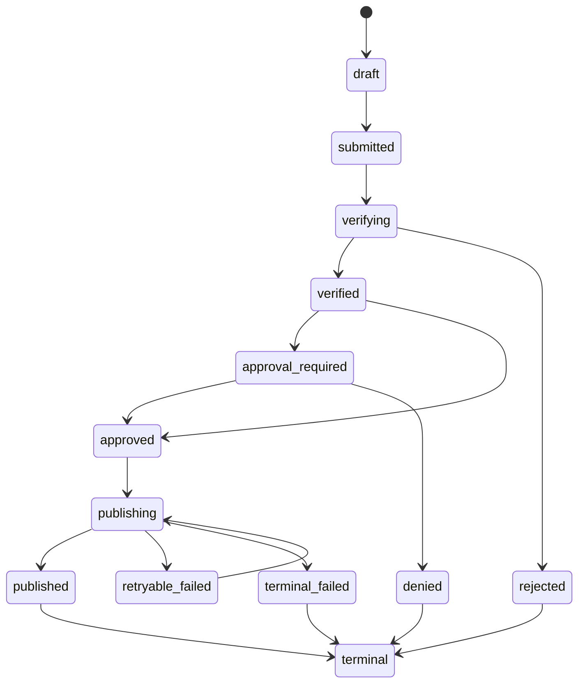
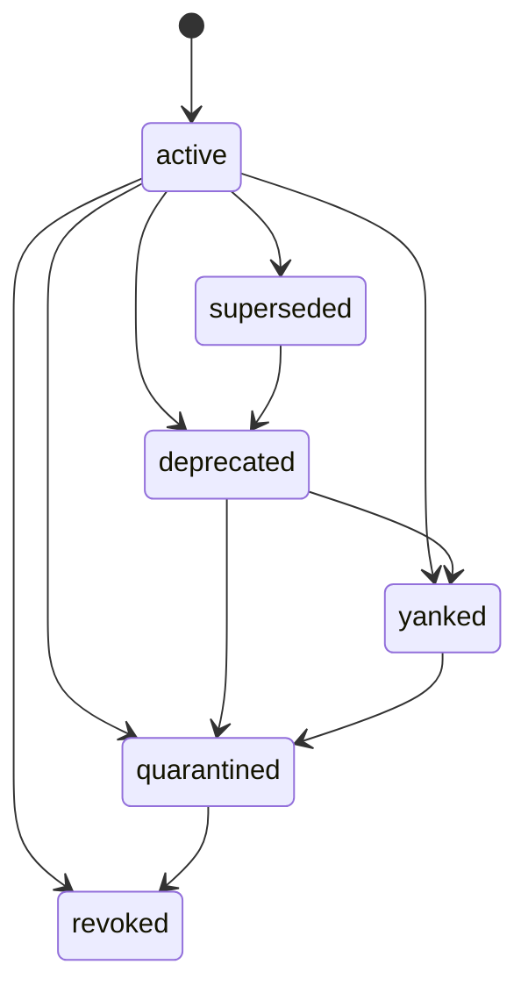
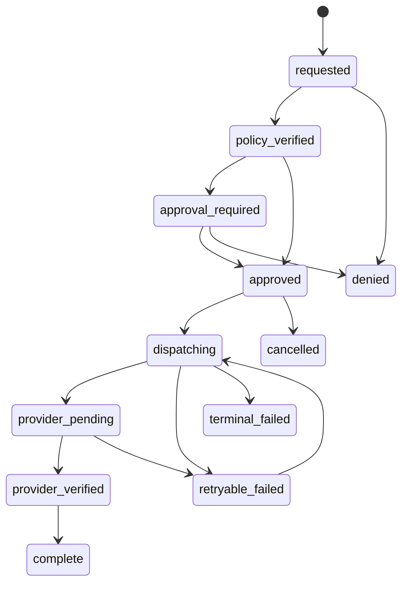
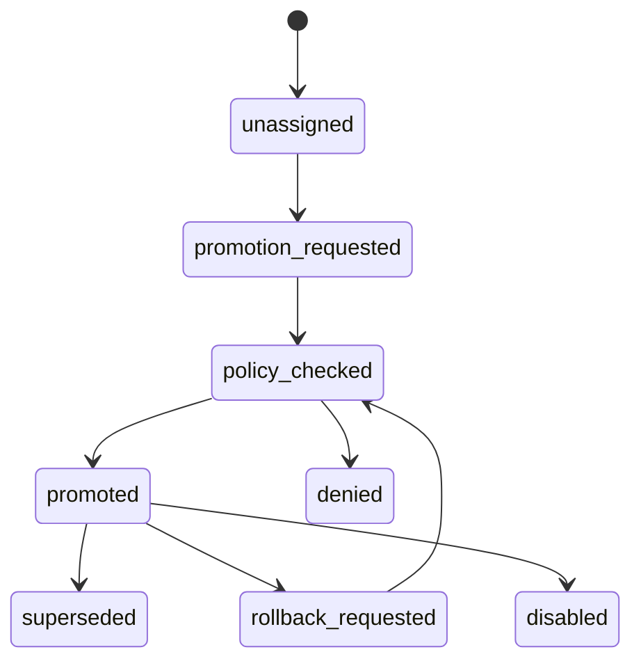

# Release Service

release-service is the internal release control plane for Verself packages. It
records what was built, what evidence was attached, what release policy decided,
what install instructions are visible, and what external providers were asked
to do. It does not build bytes. CI and Bazel own build execution, upload,
signing, and provenance generation.

The current recommendation is to build release-service first and defer
distribution-service and publishing-service as later extractions. That keeps the
first implementation small while still using the same boundaries: bytes stay in
Zot as OCI artifacts, evidence is in standard attestation formats, lifecycle
state is explicit, and provider behavior is recorded as provider-native facts.

## Standards

The durable contracts should be open standards or provider-native APIs:

- OCI Distribution and OCI Image/Artifact descriptors for pushed bytes,
  manifests, digests, tags, and referrers:
  <https://github.com/opencontainers/distribution-spec>
  and <https://github.com/opencontainers/image-spec>.
- in-toto Statement v1 for attestation envelopes:
  <https://github.com/in-toto/attestation/tree/main/spec/v1>.
- SLSA provenance and Verification Summary Attestations for build provenance
  and release verification summaries: <https://slsa.dev/spec/v1.1/>.
- TUF for a future distribution-service client update plane:
  <https://theupdateframework.github.io/specification/latest/>.
- SemVer 2.0 as the default canonical version format for Verself CLIs and
  API-bearing packages: <https://semver.org/>.
- Provider-native versioning and invalidation rules, including PEP 440,
  Debian Policy versions, npm deprecation, PyPI yanking, Cargo yanking, and
  Homebrew deprecate/disable semantics:
  <https://packaging.python.org/en/latest/specifications/version-specifiers/>,
  <https://www.debian.org/doc/debian-policy/ch-controlfields.html#version>,
  <https://docs.npmjs.com/deprecating-and-undeprecating-packages-or-package-versions/>,
  <https://docs.pypi.org/project-management/yanking/>,
  <https://doc.rust-lang.org/cargo/commands/cargo-yank.html>,
  and <https://docs.brew.sh/Deprecating-Disabling-and-Removing-Formulae>.
- OSV, CSAF, OpenVEX, and CycloneDX VEX for advisories and exploitability
  statements: <https://ossf.github.io/osv-schema/>,
  <https://docs.oasis-open.org/csaf/csaf/v2.0/csaf-v2.0.html>,
  <https://github.com/openvex/spec>, and
  <https://cyclonedx.org/capabilities/vex/>.

Do not introduce a release-ledger abstraction. The useful durable facts are
typed service rows plus standard evidence documents keyed by immutable OCI
digests.

## Boundary

release-service owns:

- release packages, package policy, and release channels;
- canonical release versions and provider-specific version projections;
- immutable artifact records pointing at Zot OCI digests;
- signatures, SLSA provenance, SBOMs, test evidence, VSAs, and provider
  receipts;
- lifecycle overlays such as deprecated, yanked, quarantined, and revoked;
- install-option read models for source builds, hosted OCI pulls, and deferred
  third-party package managers;
- internal provider publication orchestration until publishing-service is
  extracted.

release-service does not own:

- Bazel execution;
- Nomad deployment orchestration;
- artifact bytes;
- build provenance generation;
- public customer SDKs;
- package-owned arbitrary provider plugins.

## make-skill

`src/make-skill` is the first tracer package. The release metadata should expose
three install families:

| Option | Initial status | Notes |
| --- | --- | --- |
| Source build | active | Built from the repo with a package-owned Bazel target once the target exists. This is the escape hatch and developer path. |
| Hosted OCI | active | Pull an immutable build artifact from Zot using ORAS, verify signature and SLSA evidence, then install into an explicit `--bin-dir`. |
| Third-party package manager | deferred | Future distribution-service/provider work, likely Homebrew first for a CLI. apt can follow when Debian repository metadata and signing are modeled. |

The OCI install option should describe an immutable digest and a channel alias.
The digest is the thing the installer verifies. The alias is only a convenience
for discovery.

Example records for `make-skill`:

```text
package_name: make-skill
source_ref: src/make-skill
canonical_version: 0.2.0
rc_version: 0.2.0-rc.1
nightly_version: 0.2.0-nightly.20260526.1
oci_repository: admitted/make-skill
artifact_kind: cli
```

## Data Model

The database should be boring PostgreSQL with typed rows. ClickHouse receives
append-only operational evidence for audit, observability, and reconciliation,
but PostgreSQL owns the current control-plane state.

### `release_packages`

Package-level identity and policy.

```text
id uuid primary key
org_id uuid not null
package_name text not null
package_kind text not null       -- cli, npm, container, library, website, image
repo_path text not null
bazel_target text not null
owner_team text not null
default_version_scheme text not null
visibility text not null         -- internal, private, public
policy_ref text not null
created_at timestamptz not null
updated_at timestamptz not null
unique (org_id, package_name)
```

### `release_versions`

Canonical upstream release identity. This is not a provider version.

```text
id uuid primary key
package_id uuid not null references release_packages(id)
canonical_version text not null
version_scheme text not null     -- semver, pep440, debian, calendar, opaque
version_kind text not null       -- stable, rc, nightly, canary
release_sequence bigint not null
source_repository text not null
source_commit text not null
source_ref text not null
state text not null              -- draft, submitted, verified, approved, published, terminal
lifecycle_status text not null   -- active, superseded, deprecated, yanked, quarantined, revoked
created_at timestamptz not null
updated_at timestamptz not null
unique (package_id, canonical_version)
unique (package_id, version_kind, release_sequence)
```

### `release_provider_versions`

Provider-specific projections. This prevents one ecosystem's ordering rules
from corrupting another's.

```text
id uuid primary key
release_version_id uuid not null references release_versions(id)
provider_kind text not null      -- zot, npm, pypi, crates, homebrew, apt, github
provider_package text not null
provider_version text not null
provider_channel text not null   -- latest, next, nightly, suite, tap, dist-tag
version_scheme text not null
projection_policy text not null
created_at timestamptz not null
unique (provider_kind, provider_package, provider_version)
```

### `release_channels`

Mutable package aliases. A channel points at an immutable release version only
after policy verification succeeds.

```text
id uuid primary key
package_id uuid not null references release_packages(id)
channel_name text not null       -- stable, rc, nightly, canary, next
channel_kind text not null       -- stable, rc, nightly, canary
visibility text not null         -- internal, private, public
current_release_version_id uuid references release_versions(id)
policy_ref text not null
updated_by text not null
updated_at timestamptz not null
created_at timestamptz not null
unique (package_id, channel_name)
```

### `release_channel_events`

Append-only channel pointer history. This is what makes channel moves and
rollbacks explainable without treating channels as versions.

```text
id uuid primary key
channel_id uuid not null references release_channels(id)
from_release_version_id uuid references release_versions(id)
to_release_version_id uuid not null references release_versions(id)
event_kind text not null         -- promoted, rolled_back, disabled
reason_code text not null
policy_check_id uuid references release_policy_checks(id)
actor text not null
created_at timestamptz not null
```

### `release_artifacts`

Immutable OCI descriptors. The artifact digest is the principal identity for
verification and install.

```text
id uuid primary key
release_version_id uuid not null references release_versions(id)
artifact_role text not null      -- binary, archive, container, sbom, metadata
platform_os text not null
platform_arch text not null
oci_repository text not null
oci_digest text not null
oci_media_type text not null
oci_size_bytes bigint not null
zot_registry text not null
created_at timestamptz not null
unique (oci_repository, oci_digest)
```

### `release_evidence`

Evidence documents attached to a release or artifact. Store structured metadata
and keep the document itself in Zot, object storage, or PostgreSQL only when the
document is small enough and the retention policy allows it.

```text
id uuid primary key
release_version_id uuid not null references release_versions(id)
artifact_id uuid references release_artifacts(id)
evidence_kind text not null      -- cosign_signature, slsa_provenance, sbom, test, vsa, receipt, vex
predicate_type text not null
subject_digest text not null
document_digest text not null
oci_referrer_digest text not null
verified_at timestamptz
verification_state text not null -- pending, verified, rejected
created_at timestamptz not null
unique (release_version_id, evidence_kind, document_digest)
```

### `release_policy_checks`

Structured verification decisions. This is the record that explains why a
release could or could not move forward.

```text
id uuid primary key
release_version_id uuid not null references release_versions(id)
policy_ref text not null
policy_digest text not null
decision text not null           -- allowed, denied, needs_approval
decision_reason text not null
builder_id text not null
signer_identity text not null
source_commit text not null
checked_at timestamptz not null
checked_by text not null
created_at timestamptz not null
```

### `release_install_options`

Read model for install pages and the future explorer. It is generated from
verified release state and package policy, not hand-edited prose.

```text
id uuid primary key
release_version_id uuid not null references release_versions(id)
option_kind text not null        -- source, oci, third_party
status text not null             -- active, deferred, disabled
display_order int not null
command_template text not null
verification_template text not null
oci_repository text
oci_digest text
provider_kind text
provider_ref text
created_at timestamptz not null
updated_at timestamptz not null
```

### `release_publications`

Provider fan-out request. This remains internal and can later move to
publishing-service without changing package-owned release declarations.

```text
id uuid primary key
release_version_id uuid not null references release_versions(id)
provider_kind text not null
provider_package text not null
provider_channel text not null
requested_by text not null
state text not null              -- requested, policy_verified, approval_required, approved, dispatching, provider_pending, provider_verified, complete, denied, cancelled, retryable_failed, terminal_failed
idempotency_key text not null
created_at timestamptz not null
updated_at timestamptz not null
unique (provider_kind, provider_package, idempotency_key)
```

### `release_publication_receipts`

Provider ground truth after dispatch and reconciliation.

```text
id uuid primary key
publication_id uuid not null references release_publications(id)
provider_kind text not null
provider_resource_url text not null
provider_version text not null
provider_digest text not null
receipt_digest text not null
reconciled_at timestamptz
created_at timestamptz not null
unique (publication_id, receipt_digest)
```

### `release_status_events`

Append-only lifecycle overlays. These are the release-service equivalent of
provider yanks, deprecations, disables, and incident actions.

```text
id uuid primary key
release_version_id uuid not null references release_versions(id)
status text not null             -- active, superseded, deprecated, yanked, quarantined, revoked
reason_code text not null
message text not null
replacement_release_version_id uuid references release_versions(id)
advisory_id uuid
effective_at timestamptz not null
actor text not null
created_at timestamptz not null
```

### `release_advisories`

Security or defect advisories. Prefer OSV for vulnerability interchange, CSAF
when richer security advisory workflows are needed, and VEX when the important
fact is exploitability or non-exploitability of a known vulnerability.

```text
id uuid primary key
org_id uuid not null
advisory_kind text not null      -- bug, security, policy, compliance
external_id text not null
summary text not null
severity text not null
osv_json jsonb
csaf_json jsonb
vex_json jsonb
published_at timestamptz
created_at timestamptz not null
updated_at timestamptz not null
unique (org_id, external_id)
```

### `release_affected_versions`

Advisory impact by package version.

```text
id uuid primary key
advisory_id uuid not null references release_advisories(id)
release_version_id uuid not null references release_versions(id)
affected_status text not null    -- affected, fixed, not_affected, under_investigation
fixed_by_release_version_id uuid references release_versions(id)
created_at timestamptz not null
unique (advisory_id, release_version_id)
```

### `release_provider_status`

Provider-native lifecycle state. This is intentionally separate from the
Verself lifecycle overlay because ecosystems expose different controls.

```text
id uuid primary key
release_version_id uuid not null references release_versions(id)
provider_kind text not null
provider_package text not null
provider_version text not null
provider_status text not null    -- published, deprecated, yanked, disabled, removed, unavailable
provider_message text not null
observed_at timestamptz not null
created_at timestamptz not null
unique (provider_kind, provider_package, provider_version)
```

## State Diagrams

Release version state:



Lifecycle overlay:



Publication state:



Channel pointer state:



All transitions must be explicit, auditable, idempotent where practical, and
reconciled against external provider truth after irreversible provider actions.

## Versioning Model

The correct long-term model is canonical version plus provider projections.
Anything else eventually breaks across toolchains.

Canonical version:

- names the release in Verself;
- is stable across install options;
- uses the package's declared default scheme;
- is what release notes, advisories, and install pages reference first.

Provider projection:

- maps the canonical version into an ecosystem-specific version string;
- records the provider package name, provider channel, dist-tag, suite, tap, or
  alias;
- follows the provider's ordering and invalidation rules;
- is independently reconciled after publication.

Examples:

| Release kind | Canonical version | npm projection | Debian projection | Homebrew projection |
| --- | --- | --- | --- | --- |
| Stable | `0.2.0` | `0.2.0` with `latest` | `0.2.0-1` | formula version `0.2.0` |
| RC | `0.2.0-rc.1` | `0.2.0-rc.1` with `next` | `0.2.0~rc.1-1` | usually not published |
| Nightly | `0.2.0-nightly.20260526.1` | optional `nightly` tag | usually not published | usually not published |

Do not treat channels as versions. `latest`, `next`, `nightly`, Debian suites,
Homebrew taps, and OCI tags are mutable pointers to immutable releases.

## Invalidation and Deprecation

Release invalidation is a status overlay. The bytes and evidence stay immutable.

Use these states:

| State | Meaning | Resolver behavior | Provider projection |
| --- | --- | --- | --- |
| `superseded` | A newer release should be preferred. | Resolve only when explicitly requested or when channel history needs it. | Usually no provider action. |
| `deprecated` | Still usable, but users should move. | Show warning and replacement. | npm deprecate, Homebrew `deprecate!`, advisory note. |
| `yanked` | Avoid in dependency/default resolution. | Do not choose by default; exact historical installs may remain possible by policy. | PyPI yank, Cargo yank, provider-specific metadata. |
| `quarantined` | Stop serving immediately from Verself-controlled resolvers. | Deny anonymous/default resolution and require incident override for forensic pull. | Disable package-manager aliases or remove from generated repo metadata. |
| `revoked` | Artifact, signer, builder, or provenance trust is broken. | Reject verification and installs. | Provider takedown or strongest available disable path. |

Provider examples:

- npm deprecation warns during install and is preferred over unpublish for most
  maintenance cases.
- PyPI yanking keeps a file available for exact pins while preventing normal
  selection.
- Cargo yanking prevents new dependency resolution but does not delete the
  crate.
- Homebrew `deprecate!` warns while `disable!` blocks installation.
- apt repositories do not have universal yanking semantics; publish fixed
  higher versions, adjust repository metadata, and issue an advisory.

Security event flow:

1. Mark the release `quarantined` when user safety or integrity is uncertain.
2. Stop default install-option resolution for affected channels.
3. Attach an advisory and affected-version records.
4. Attach OpenVEX/CycloneDX VEX or OSV/CSAF evidence when applicable.
5. Reconcile provider-native status and apply deprecate, yank, disable, or
   repository metadata changes.
6. Publish a fixed release with a new immutable digest.
7. If signer, builder, or provenance integrity is compromised, mark affected
   releases `revoked`, rotate keys, and record the signing-root incident.

## SLSA and Security Model

Build and sign stay in CI:

- Bazel builds the package target.
- CI pushes artifacts to Zot.
- CI signs artifacts with cosign backed by OpenBao Transit where possible.
- CI attaches SLSA provenance, SBOMs, and required test evidence as OCI
  referrers.

release-service verifies:

- the OCI descriptor digest matches the in-toto subject digest;
- the signer identity is allowed for the package and channel;
- the SLSA builder id is allowed for the package and release kind;
- the source repo, source commit, Bazel target, package, version, and platform
  match package policy;
- required evidence exists before release approval;
- lifecycle state allows publication and install-option visibility.

release-service may sign a SLSA Verification Summary Attestation for its
verification decision. It must not sign build provenance.

The near-term SLSA target is Build L2 for CI-produced artifacts. Build L3 is a
separate hardening step that requires builder isolation strong enough that build
steps cannot tamper with provenance or signing decisions.

Provider credentials:

- Store provider credentials through secrets-service/OpenBao.
- Prefer provider OIDC/trusted-publisher flows over long-lived stored tokens.
- Scope stored credentials by provider, package, channel, and operation.
- Issue delegated publish authorizations only when they are audience-bound,
  artifact-digest-bound, package-bound, provider-bound, short-lived, and
  single-use.
- Provider adapters own API versions, idempotency keys, retries, pagination,
  rate limits, telemetry, and webhook authenticity checks.

## Internal API

This is an internal service. Keep it out of verself-cli and public SDKs.

Initial Smithy operations:

| Operation | Purpose |
| --- | --- |
| `RegisterPackage` | Create package identity, owner, source path, Bazel target, and policy reference. |
| `CreateReleaseVersion` | Create canonical version state for stable, RC, nightly, or canary releases. |
| `AttachArtifact` | Record an immutable OCI descriptor pushed by CI. |
| `AttachEvidence` | Record a signature, SLSA provenance, SBOM, test result, VSA, VEX, or provider receipt. |
| `VerifyRelease` | Evaluate package policy against artifacts and evidence. |
| `ApproveRelease` | Record human or policy approval before irreversible publication. |
| `PromoteReleaseChannel` | Move a mutable channel alias to a verified immutable release version. |
| `CreatePublication` | Request provider fan-out for an approved release. |
| `DispatchPublication` | Worker-only operation that calls provider adapters. |
| `RecordPublicationReceipt` | Persist provider response and reconciliation evidence. |
| `ReconcilePublication` | Re-read provider ground truth and repair local state. |
| `SetReleaseLifecycleStatus` | Add a lifecycle overlay such as deprecated or quarantined. |
| `CreateReleaseAdvisory` | Publish vulnerability or defect metadata and affected versions. |
| `ListInstallOptions` | Return generated install instructions for an operator or website read model. |

The operator explorer can be a separate VitePlus app later. It should be a
visual browser for releases, artifacts, evidence, lifecycle events, provider
status, and install options. It should not become the semantic API surface.

## Channel Flows

Stable release:

1. Package-owned Bazel target builds `make-skill`.
2. CI pushes immutable artifacts to `admitted/make-skill` in Zot.
3. CI signs artifacts and attaches SLSA provenance, SBOM, and test evidence.
4. release-service attaches artifact and evidence records.
5. `VerifyRelease` checks policy and produces a verification decision.
6. Approval records the irreversible release decision.
7. Hosted OCI install option becomes active for the immutable digest.
8. Provider publication runs only for providers configured by package policy.
9. Newsroom publication can be generated from the same release facts, but the
   post authoring model can remain markdown until a better content service
   exists.

Release candidate:

1. Use a canonical prerelease version such as `0.2.0-rc.1`.
2. Require the same digest, signature, and SLSA evidence checks as stable unless
   package policy explicitly weakens a non-public channel.
3. Publish to RC aliases such as OCI `rc` or npm `next`.
4. Do not move stable aliases.
5. Do not create a newsroom post by default.

Nightly:

1. Use a monotonically unique canonical version such as
   `0.2.0-nightly.20260526.1`.
2. Default to hosted OCI only.
3. Apply shorter retention and weaker external publication defaults.
4. Never overwrite provider versions. Channel pointers may move; versions do
   not.

## Observability and Recovery

Every release decision should emit governance audit and ClickHouse evidence with
`org_id`, package, canonical version, release kind, artifact digest, OCI
repository, source commit, Bazel target, signer identity, SLSA builder id,
policy id, lifecycle status, provider kind, provider version, request id, trace
id, and actor.

`/recoveryz` should report PostgreSQL migration state, Zot reachability,
referrer query health, OpenBao/secrets reachability, provider adapter health,
provider reconciliation lag, outbox backlog, and ClickHouse write health.

Recovery should be able to rebuild service state from Zot descriptors,
referrers, provider receipts, provider ground truth, and retained PostgreSQL
state. It must not require mutable build outputs or CI logs as the only source
of truth.
