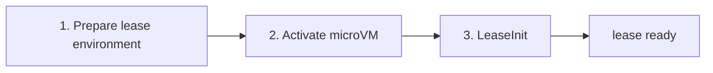
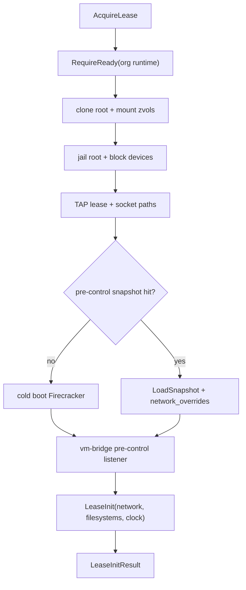
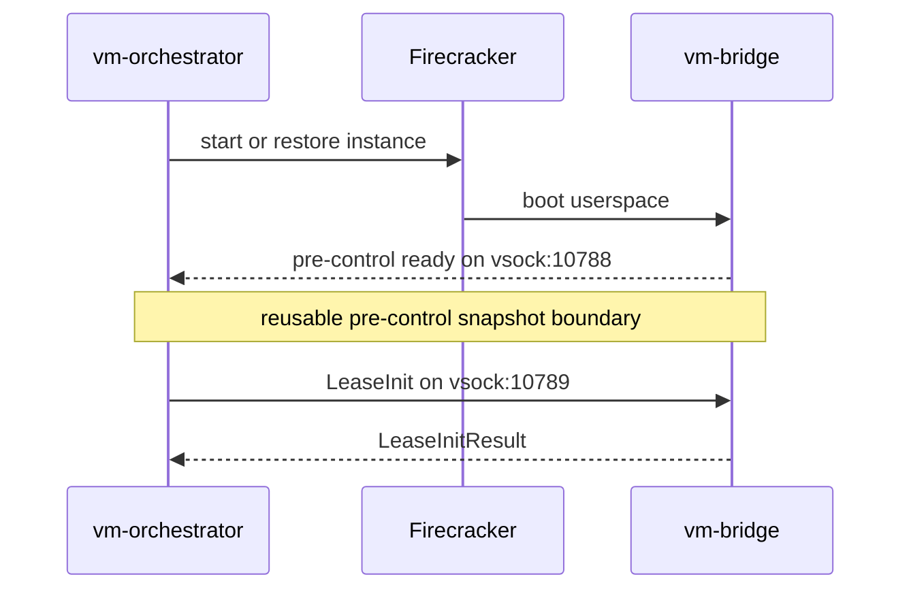
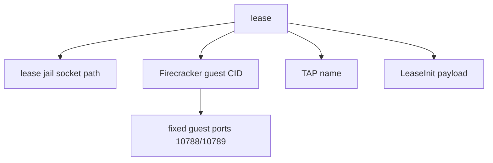
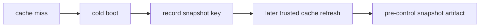
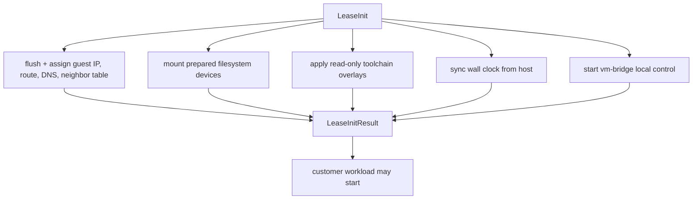
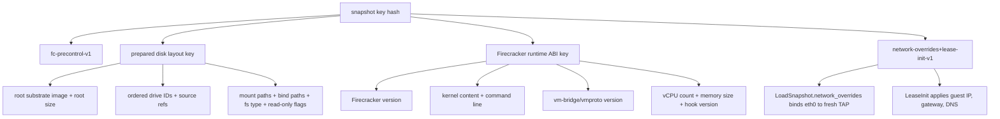
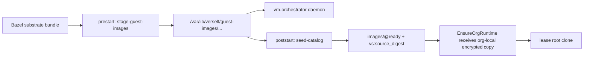
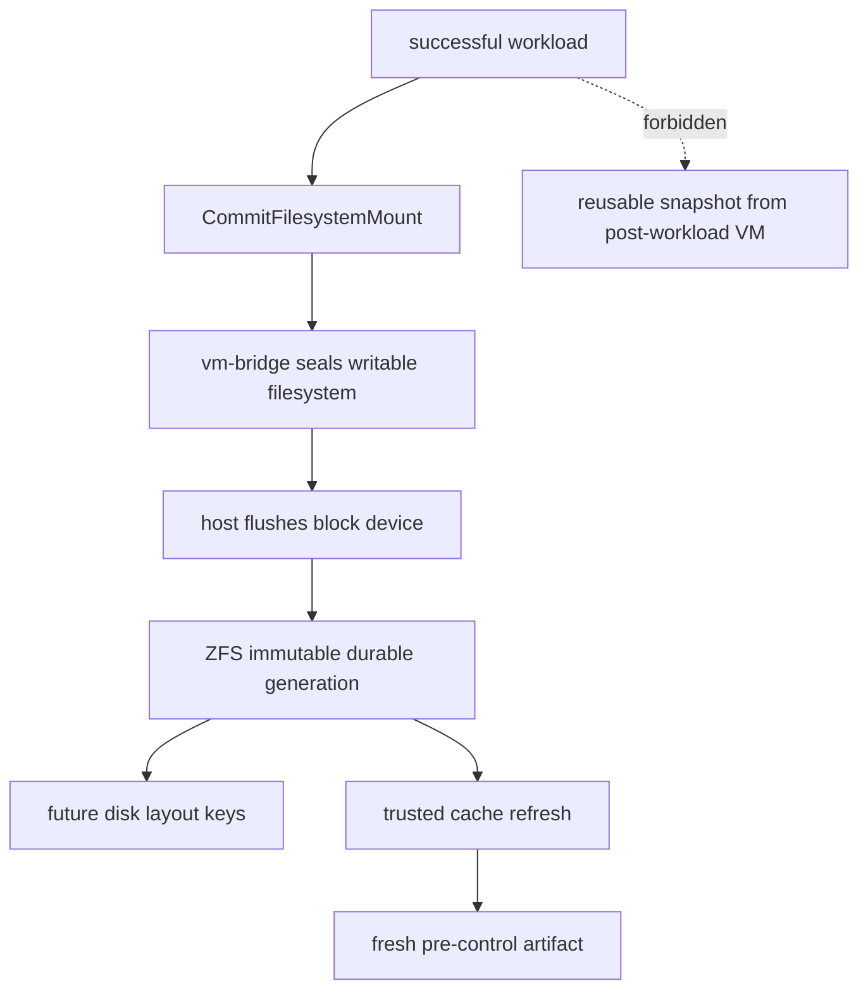

# Firecracker Snapshot Lifecycle

vm-orchestrator treats Firecracker snapshots as lease activation cache
artifacts. ZFS generations remain durable workspace and cache state.

| Case | Behavior |
| --- | --- |
| Snapshot hit | Restore, apply network override, run `LeaseInit`. |
| Snapshot miss | Cold boot, run `LeaseInit`, record computed key. |
| Snapshot creation | Trusted cache refresh only, after the zvol graph is known-good. |

## Snapshot Boundary

| Port | Scope | Protocol |
| --- | --- | --- |
| `10788` | Guest vsock namespace | Pre-control readiness probe. |
| `10789` | Guest vsock namespace | Lease control protocol. |

| Snapshot contains |
| --- |
| Booted guest kernel. |
| Substrate userspace. |
| vm-bridge at pre-control listener boundary. |
| Firecracker device model state. |
| Memory required to resume at the boundary. |

| Snapshot excludes |
| --- |
| Lease ID. |
| Attempt ID. |
| Customer exec state. |
| Wall-clock-correct guest time. |
| Per-lease network address. |
| Mounted durable filesystems after `LeaseInit`. |
| Product bootstrap secrets or runner tokens. |

## LeaseInit Contract

## Cache Key

| Excluded from snapshot key | Owner |
| --- | --- |
| GitHub workflow semantics | sandbox-rental job-shape model |
| Matrix semantics | sandbox-rental job-shape model |
| Durable zvol generation choice | Prepared disk layout key after source resolution |
| TAP name, slot index, guest IP, gateway | Per-lease runtime state |

## Deploy Ownership

| Artifact | Owner |
| --- | --- |
| daemon binary | `vm-orchestrator` Nomad component |
| substrate image with vm-bridge | `vm-orchestrator` Nomad component |
| staged guest images | prestart `stage-guest-images` task |
| ZFS image zvols | poststart `seed-catalog` task |

## Post-Workload State

