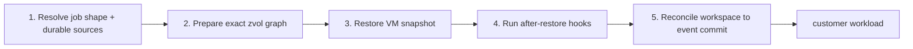
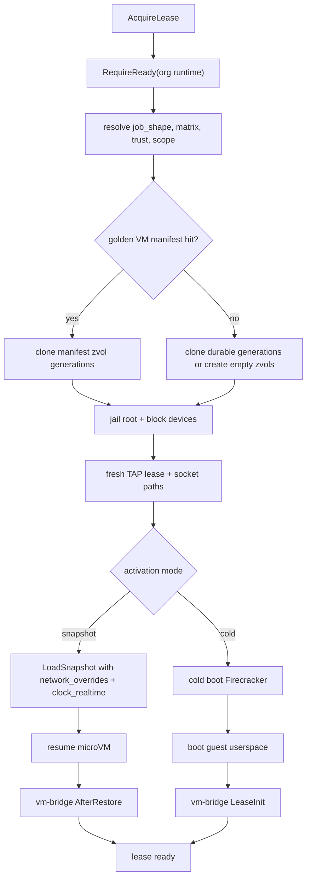
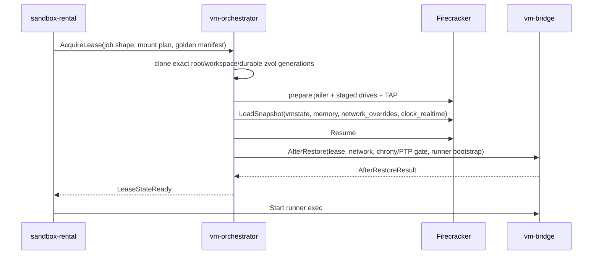
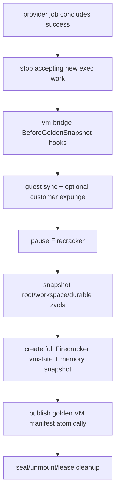
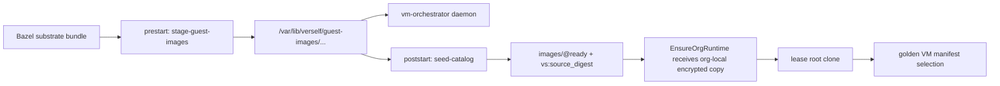

# Firecracker Golden Snapshot Lifecycle

vm-orchestrator treats a Firecracker golden snapshot as one atomic reusable
execution artifact: Firecracker VM state, guest memory, the exact root and
durable ZFS generation set, and the restore hooks needed to rebind the VM to a
new lease. The snapshot is selected after sandbox-rental has resolved the
provider job shape, matrix leg, trust class, target scope, and durable cache
generations.

## Restore Flow

Snapshot restore happens after the host has prepared the block-device graph and
fresh network device, and before vm-bridge is used for lease control. The first
guest control operation on a restored VM is `AfterRestore`, not customer exec.
That hook is responsible for making the resumed process tree belong to the new
lease.

`AfterRestore` applies:

- Fresh lease identity, attempt identity, runner identity, and provider runtime
  metadata.
- Chrony/KVM PTP synchronization before customer exec.
- Network rebinding for the fresh TAP address, gateway, DNS, and neighbor
  state.
- Host control socket reconnection.
- Runner token or bootstrap material for the current provider job.
- Optional customer expunge hooks before the resumed VM is exposed to the job.

The Verself checkout action still reconciles `GITHUB_WORKSPACE` to the event
commit before customer steps run. PR jobs normally restore from the target
branch's latest compatible golden VM snapshot, then checkout advances the
workspace to the PR head.

## Snapshot Boundary

The snapshot contains guest memory and process state. Warm processes such as a
Bazel server, language daemons, local databases, Docker/BuildKit helpers, and
filesystem page cache can survive restore when their backing paths and runtime
identity match the manifest.

The snapshot is not independently reusable from its disks. A VM snapshot hit is
valid only when every zvol generation and image reference named by the manifest
is available and attached with the same drive IDs, mount paths, bind paths,
filesystem type, and read/write policy.

## Snapshot Save Point

Golden VM snapshot creation runs after a protected branch job has completed
successfully and before vm-orchestrator unmounts or destroys the lease's guest
filesystems.

The save path records one manifest that couples:

- Firecracker `vmstate` and memory snapshot paths.
- Root zvol checkpoint identity.
- Workspace and declared durable cache generation identities.
- Drive topology and guest mount topology.
- Runtime ABI and restore hook versions.
- Product identity that decides who may read the artifact.

If any part of the checkpoint fails, the golden VM pointer does not advance.
Durable zvol generations may still commit through the ordinary durable-cache
rules, but they do not imply a reusable VM snapshot without a matching manifest.

## Firecracker Constraints

Firecracker snapshot support imposes host-side requirements that are part of
the Verself manifest contract:

- `LoadSnapshot` runs before the restored microVM starts.
- Snapshot creation requires a paused microVM.
- Firecracker writes the VM state file and guest memory file; block-device
  contents are caller-managed and must be snapshotted by vm-orchestrator.
- The pinned Firecracker `LoadSnapshot` request receives per-lease TAP
  rebinding through `network_overrides` and `clock_realtime=true`;
  vm-bridge restore hooks require chrony synchronization through `/dev/ptp0`
  before host control exposes customer exec.
- Guest network connections and open vsock connections are not reusable across
  a restored Firecracker process. `AfterRestore` reconnects host control and
  rebinds per-lease network state.
- Snapshot format compatibility is tied to the Firecracker binary and runtime
  ABI. The manifest key includes those ABI dimensions.

## Compatibility Key

The golden VM snapshot key is a product-level compatibility key. It is derived
after GitHub and durable-cache semantics have been lowered into stable service
identity.

```mermaid
flowchart TD
    key["golden VM snapshot key"] --> product["product scope"]
    key --> disks["exact zvol generation set"]
    key --> abi["runtime ABI"]
    key --> hooks["hook/profile versions"]

    product --> org["org + repository + provider repository"]
    product --> scope["scope kind/ref + trust class"]
    product --> job["job_shape_id"]

    disks --> root["root substrate ref + snapshot GUID"]
    disks --> workspace["workspace generation ID + zfs snapshot ref/GUID"]
    disks --> durable["declared durable generations + mount layout"]

    abi --> fc["Firecracker + jailer version/hash"]
    abi --> kernel["kernel content + command line"]
    abi --> resources["guest arch + runner class + vCPU + memory"]
    abi --> proto["vm-bridge/vmproto version"]

    hooks --> restore["AfterRestore hook version"]
    hooks --> save["BeforeGoldenSnapshot hook version"]
    hooks --> profile["warm snapshot profile"]
```

`job_shape_id` carries workflow identity, called workflow identity, job
identity, matrix key, runner class, guest architecture, platform image ID,
kernel image ID, runner toolchain image ID, and cache spec hash. Matrix legs
therefore split naturally without adding a separate ad hoc key.

The key intentionally excludes provider run ID, provider run attempt, provider
job ID, lease ID, TAP name, guest IP, gateway, DNS, and PR head SHA. Those are
per-run facts. Checkout reconciles the restored workspace to the event commit.

## Hit And Miss Behavior

| Case | Behavior |
| --- | --- |
| Golden VM hit | Clone the exact zvol generations from the manifest, restore Firecracker, run `AfterRestore`, then checkout to the event commit. |
| Golden VM miss with durable hits | Boot normally from the latest compatible durable generations, run `LeaseInit`, and execute the job cold at the process level. |
| Durable miss | Create empty cache zvols, boot normally, and let the job rebuild. |
| Partial manifest miss | Treat as a golden VM miss. VM state and disks never resolve independently. |

## Operational Invariants

- A published golden VM manifest must be immutable.
- A current pointer update is compare-and-swap against the source generation
  set observed before the protected branch job started.
- Restore must stage zvols before `LoadSnapshot`.
- Restore must run `AfterRestore` before customer exec.
- Snapshot save must run before filesystem seal/unmount if it is meant to
  preserve live process state.
- Retention must not prune any zvol generation referenced by a current golden
  VM manifest.
- Trust class is a read-policy dimension, not just metadata.

## Host Interface

sandbox-rental owns product lookup and promotion. vm-orchestrator owns host
validation, Firecracker calls, ZFS mutation, and artifact publication.

`AcquireLease` receives:

- The static filesystem mount plan for workspace and declared durable caches.
- Storage namespace and resource shape.
- An optional golden VM activation manifest: snapshot ID, expected snapshot
  key, generation-set hash, vmstate artifact ref, and memory artifact ref.

`AcquireLease` returns:

- Lease identity and host-ready state.
- Filesystem mount results.
- Activation result: `snapshot_restore`, `cold_boot`, or disabled snapshots.
- Snapshot key and miss reason when the golden VM manifest was not restored.

`CheckpointGoldenVM` runs only after the provider job is terminal successful
and before durable filesystems are sealed. It returns Firecracker artifact
refs, root checkpoint identity, artifact byte counts, and checkpoint time.

`CommitFilesystemMount` remains the per-mount durable generation API. When a
golden VM checkpoint exists, it clones from the checkpoint zvol snapshot.
Otherwise it snapshots the working mount after guest seal.

## Deploy Ownership

| Artifact | Owner |
| --- | --- |
| daemon binary | `vm-orchestrator` Nomad component |
| substrate image with vm-bridge | `vm-orchestrator` Nomad component |
| staged guest images | prestart `stage-guest-images` task |
| ZFS image and durable zvol generations | vm-orchestrator host storage |
| Firecracker vmstate/memory artifacts | vm-orchestrator snapshot store |
| golden VM manifest and current pointer | sandbox-rental product state |

## References

- Firecracker snapshot support:
  <https://github.com/firecracker-microvm/firecracker/blob/main/docs/snapshotting/snapshot-support.md>
- Firecracker snapshot versioning:
  <https://github.com/firecracker-microvm/firecracker/blob/main/docs/snapshotting/versioning.md>
