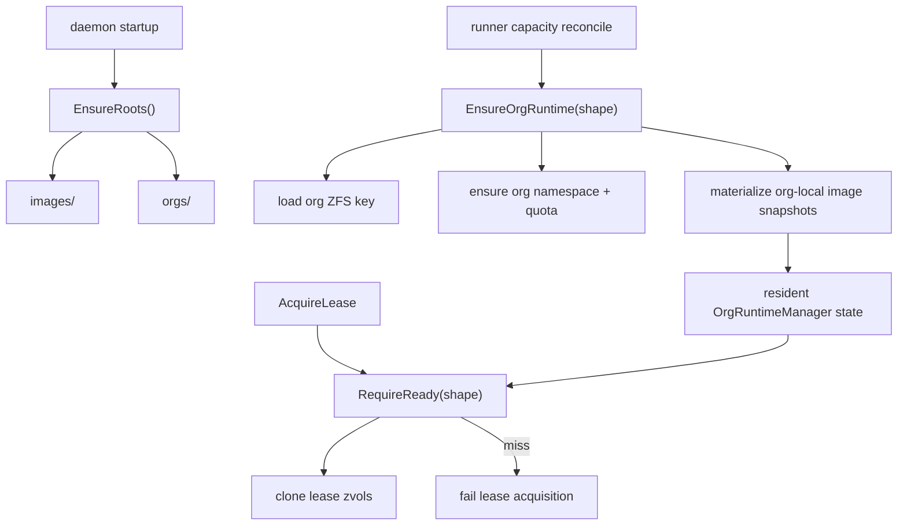
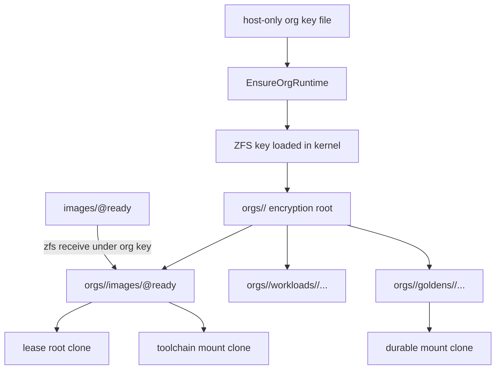
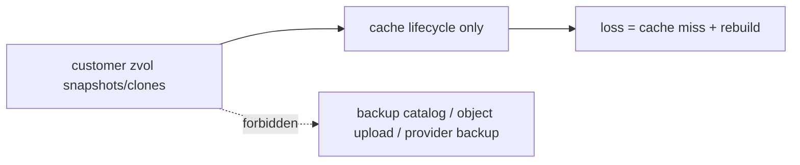
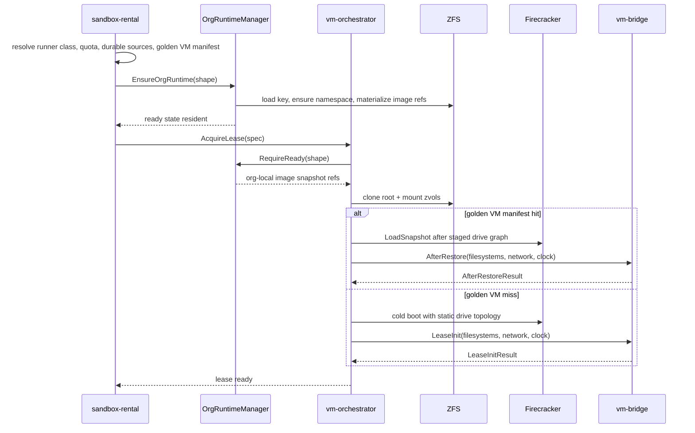
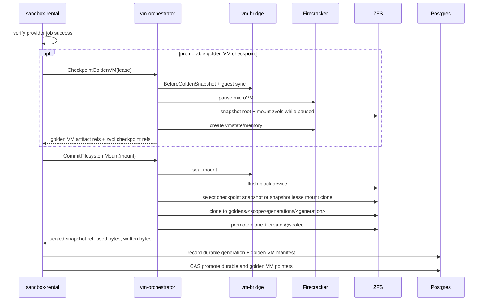
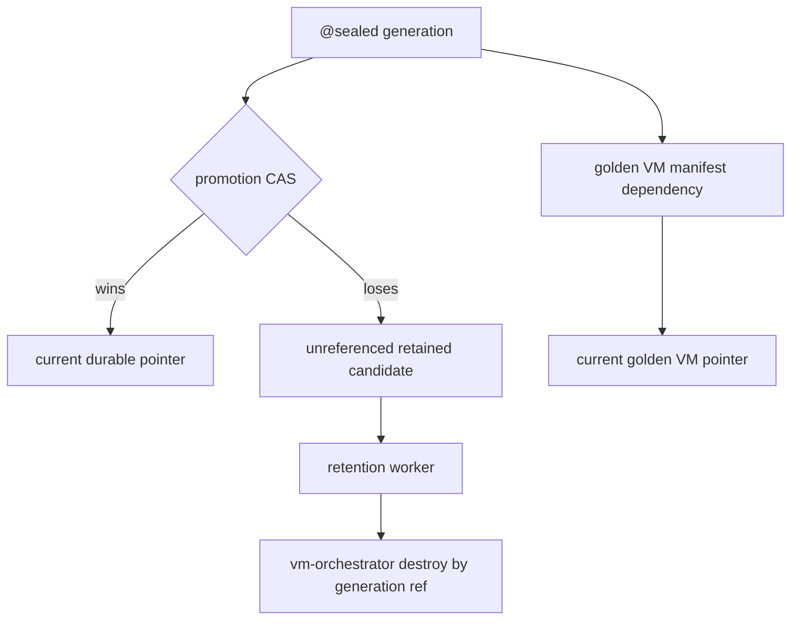

# ZFS Volume Lifecycle

vm-orchestrator owns privileged ZFS lifecycle for Firecracker leases. Product
services pass service-authorized refs over the Unix socket; guests never pass
ZFS dataset names, host paths, or mutation intents.

## Dataset Roots

Default roots under the configured pool:

| Root | Purpose |
| --- | --- |
| `images/` | Read-only composable toolchain images seeded by `SeedImage`. |
| `orgs/<org>/images/` | Org-encrypted received copies of platform images used as clone origins for that org. |
| `orgs/<org>/workloads/` | Ephemeral per-lease root disks and writable mount clones under the org quota. |
| `orgs/<org>/goldens/` | Immutable durable zvol generations committed after a seal-eligible successful execution under the org quota. |

## Customer Dataset Encryption

| Boundary | Rule |
| --- | --- |
| Runtime key owner | vm-orchestrator only. |
| Product services and guests | Never receive raw keys or dataset names. |
| Org datasets | `mountpoint=none`, `canmount=off`; guests receive zvol block devices. |
| Lease cleanup | Releases daemon raw-key material; does not unload the kernel-held ZFS key. |
| Key unload / rotation | Security event, host drain/shutdown policy, or org tombstone. |

## Backup Exclusion

| Artifact | Classification |
| --- | --- |
| Customer zvol snapshots | Cache lifecycle artifact. |
| Customer zvol clones | Cache lifecycle artifact. |
| CI golden artifact loss | Cache miss and rebuild. |

## Lease Boot

| Mount case | Result |
| --- | --- |
| Missing durable generation | Cache miss; create fresh ext4 zvol. |
| Missing platform image | Lease failure. |
| Required mount failure | Lease failure. |
| Optional mount failure | Degraded cache state. |
| Post-boot block-device attach | Unsupported. |

## Commit

| Promotion step | Owner |
| --- | --- |
| Golden VM checkpoint and Firecracker artifact creation | vm-orchestrator |
| Host seal and immutable zvol generation creation | vm-orchestrator |
| Operation, generation, and manifest metadata | sandbox-rental |
| Protected-branch current pointer CAS | sandbox-rental |

## Retention

Retention must preserve any durable generation referenced by
`durable_current_pointer` or `golden_vm_snapshot_generation`. Firecracker
vmstate and memory artifacts are retained through the golden VM manifest, not
through ZFS lineage.
